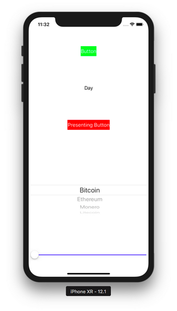

# Testing

There are two types of testing: unit testing and UI testing.

When you create a new project, you have options to create unit testing and UI testing.
<p align="center">

</p>

But if you forgot to check both options, you can add unit test and UI test manually.
<p align="center">

</p>

Create a new single-view application. Don’t forget to check “Include Unit Tests” and “Include UI Tests”.

## Unit Test

Then edit HelloTesting1Tests.swift.
<p align="center">

</p>

You’ll have this content in the unit test file.
```swift
import XCTest
@testable import HelloTesting1

class HelloTesting1Tests: XCTestCase {

    override func setUp() {
        // Put setup code here. This method is called before the invocation of each test method in the class.
    }

    override func tearDown() {
        // Put teardown code here. This method is called after the invocation of each test method in the class.
    }

    func testExample() {
        // This is an example of a functional test case.
        // Use XCTAssert and related functions to verify your tests produce the correct results.
    }

}
```

setUp is a method that will be executed every time before you run a test. The unit test itself is a method that starts with test word, for example: testExample. tearDown is a method that will be executed every time after you run a test.

You can construct an instance of class on which you want to test the method. 
```swift
class HelloTesting1Tests: XCTestCase {
    
    var viewController : ViewController!

    override func setUp() {
        viewController = ViewController()
    }

Then in testExample, add this code.
    func testExample() {
        // This is an example of a functional test case.
        // Use XCTAssert and related functions to verify your tests produce the correct results.
        let result = viewController.calculate(2, 3)
        XCTAssertEqual(result, 5, "should be 5")
    }
```

You can execute the test by using shortcut: Cmd + U.
<p align="center">

</p>

You’ll have your test failed.
<p align="center">

</p>

Let’s implement calculate method in ViewController class.
```swift
    func calculate(_ a: Int, _ b: Int) -> Int {
        return a + b
    }
```

Go back to your unit test file. You can also execute a particular unit test with a button on line number.
<p align="center">

</p>

You’ll have your test succeeds.

Now let’s add some UI controls on the screen.

This is the code for ViewController class.
```swift
class ViewController: UIViewController, UIPickerViewDelegate, UIPickerViewDataSource {
    
    var button: UIButton!
    var label: UILabel!
    var presentingButton: UIButton!
    var pickerView: UIPickerView!
    var slider: UISlider!
    var cryptocurrencies = ["Bitcoin", "Ethereum", "Monero", "Litecoin"]

    override func viewDidLoad() {
        super.viewDidLoad()
        // Do any additional setup after loading the view, typically from a nib.
        
        self.button = UIButton()
        self.button.backgroundColor = .green
        self.button.setTitle("Button", for: .normal)
        self.button.translatesAutoresizingMaskIntoConstraints = false
        self.view.addSubview(self.button)
        NSLayoutConstraint.activate([
            self.button.centerXAnchor.constraint(equalTo: self.view.centerXAnchor),
            self.button.topAnchor.constraint(equalTo: self.view.topAnchor, constant: 100)
        ])
        self.button.accessibilityIdentifier = "primaryButton"
        self.button.addTarget(self, action: #selector(buttonTapped(_:)), for: .touchUpInside)
        
        self.label = UILabel()
        self.label.text = "Day"
        self.label.translatesAutoresizingMaskIntoConstraints = false
        self.view.addSubview(self.label)
        NSLayoutConstraint.activate([
            self.label.centerXAnchor.constraint(equalTo: self.view.centerXAnchor),
            self.label.topAnchor.constraint(equalTo: self.button.bottomAnchor, constant: 100)
        ])
        
        self.presentingButton = UIButton()
        self.presentingButton.backgroundColor = .red
        self.presentingButton.setTitle("Presenting Button", for: .normal)
        self.presentingButton.translatesAutoresizingMaskIntoConstraints = false
        self.view.addSubview(self.presentingButton)
        NSLayoutConstraint.activate([
            self.presentingButton.centerXAnchor.constraint(equalTo: self.view.centerXAnchor),
            self.presentingButton.topAnchor.constraint(equalTo: self.label.bottomAnchor, constant: 100)
        ])
        self.presentingButton.addTarget(self, action: #selector(presentingButtonTapped(_:)), for: .touchUpInside)
        
        self.pickerView = UIPickerView()
        self.pickerView.delegate = self
        self.pickerView.translatesAutoresizingMaskIntoConstraints = false
        self.view.addSubview(self.pickerView)
        NSLayoutConstraint.activate([
            self.pickerView.topAnchor.constraint(equalTo: self.presentingButton.bottomAnchor, constant: 100),
            self.pickerView.centerXAnchor.constraint(equalTo: self.view.centerXAnchor),
            self.pickerView.widthAnchor.constraint(equalToConstant: 400)
        ])
        
        self.slider = UISlider()
        self.slider.minimumValue = 0
        self.slider.maximumValue = 100
        self.slider.minimumTrackTintColor = .yellow
        self.slider.maximumTrackTintColor = .blue
        self.slider.translatesAutoresizingMaskIntoConstraints = false
        self.slider.accessibilityIdentifier = "slider"
        self.view.addSubview(self.slider)
        NSLayoutConstraint.activate([
            self.slider.topAnchor.constraint(equalTo: self.pickerView.bottomAnchor, constant: 100),
            self.slider.centerXAnchor.constraint(equalTo: self.view.centerXAnchor),
            self.slider.widthAnchor.constraint(equalToConstant: 400)
        ])
    }
    
    func numberOfComponents(in pickerView: UIPickerView) -> Int {
        return 1
    }
    
    func pickerView(_ pickerView: UIPickerView, numberOfRowsInComponent component: Int) -> Int {
        return cryptocurrencies.count
    }
    
    func pickerView(_ pickerView: UIPickerView, titleForRow row: Int, forComponent component: Int) -> String? {
        return cryptocurrencies[row]
    }
    
    @objc func buttonTapped(_ sender: UIButton) {
        self.label.text = "Night"
    }
    
    @objc func presentingButtonTapped(_ sender: UIButton) {
        let viewController2 = ViewController2()
        self.present(viewController2, animated: true, completion: nil)
    }

    func calculate(_ a: Int, _ b: Int) -> Int {
        return a + b
    }

}
```

You’ll also need the code for ViewController2.swift.
```swift
class ViewController2: UIViewController {
    
    var textField: UITextField!
    var button: UIButton!

    override func viewDidLoad() {
        super.viewDidLoad()
        
        self.view.backgroundColor = .white

        // Do any additional setup after loading the view.
        self.textField = UITextField()
        self.textField.backgroundColor = .yellow
        self.textField.translatesAutoresizingMaskIntoConstraints = false
        self.view.addSubview(self.textField)
        NSLayoutConstraint.activate([
            self.textField.centerXAnchor.constraint(equalTo: self.view.centerXAnchor),
            self.textField.topAnchor.constraint(equalTo: self.view.topAnchor, constant: 100),
            self.textField.widthAnchor.constraint(equalToConstant: 200)
        ])
        self.textField.accessibilityIdentifier = "primaryTextField"
        
        self.button = UIButton()
        self.button.backgroundColor = .green
        self.button.setTitle("Button", for: .normal)
        self.button.translatesAutoresizingMaskIntoConstraints = false
        self.view.addSubview(self.button)
        NSLayoutConstraint.activate([
            self.button.centerXAnchor.constraint(equalTo: self.view.centerXAnchor),
            self.button.topAnchor.constraint(equalTo: self.textField.bottomAnchor, constant: 100)
        ])
    }
    

}
```

Run it and you’ll have this screen.
<p align="center">

</p>

If you click “Button” button, the label’s text will be changed from “Day” to “Night”.

If you click “Presenting Button” button, you’ll get into the next screen.
<p align="center">

</p>

You can test the clicking button and its result. Add another unit test.
```swift
    func test_Button() {
        let viewController = ViewController()
        viewController.loadViewIfNeeded()
        XCTAssertNotNil(viewController.button)
        
        XCTAssertEqual(viewController.label.text, "Day", "should be Day")
        viewController.button.sendActions(for: .touchUpInside)
        XCTAssertEqual(viewController.label.text, "Night", "should be Night")
    }
```

But testing the UI aspect is best done not in unit test but UI test.

## UI Testing

Click UI test file.
<p align="center">

</p>

Edit the content of the UI test file to be like this:
```swift
class HelloTesting1UITests: XCTestCase {
    
    var app: XCUIApplication!

    override func setUp() {
        continueAfterFailure = false

        app = XCUIApplication()
        app.launch()

    }

    override func tearDown() {
    }
}
```

app which is the instance of XCUIApplication is the proxy to application itself.

Let’s create a UI test method.
```swift
    func testExample() {
        app.pickerWheels.element.adjust(toPickerWheelValue: "Litecoin")
        app.sliders["slider"].adjust(toNormalizedSliderPosition: 0.8)
        
        var dayLabel = app.staticTexts["Day"]
        var nightLabel = app.staticTexts["Night"]
        XCTAssertFalse(nightLabel.exists)
        XCTAssertTrue(dayLabel.exists)
        app.buttons["primaryButton"].tap()
        dayLabel = app.staticTexts["Day"]
        nightLabel = app.staticTexts["Night"]
        XCTAssertTrue(nightLabel.exists)
        XCTAssertFalse(dayLabel.exists)
        
        app.buttons["Presenting Button"].tap()
        app.textFields["primaryTextField"].tap()
        app.textFields["primaryTextField"].typeText("hello")
        app.buttons["Button"].tap()
    }
```

To change the value of the picker view, you use this way:
```swift
app.pickerWheels.element.adjust(toPickerWheelValue: "Litecoin")
```

This assumes you have only one picker view. 

To change the value of the slider view, you use this way:
```swift
app.sliders["slider"].adjust(toNormalizedSliderPosition: 0.8)
```

This time, you access a particular slider with accessibility identifier.  Previously in ViewController, you set the accessibility identifier with this way:
```swift
self.slider.accessibilityIdentifier = "slider"
```

To get the text of the label, you use this way.
```swift
        var dayLabel = app.staticTexts["Day"]
        var nightLabel = app.staticTexts["Night"]
```

Then to test whether this text of the label exists or not, you use this assertion.
```swift
        XCTAssertFalse(nightLabel.exists)
        XCTAssertTrue(dayLabel.exists)
```

If you want to tap button, you can use tap method.
```swift
        app.buttons["primaryButton"].tap()
```

The “primaryButton” is the accessibility identifier. But you can also use the text in the button to access the button.

To type the text field, you have to tap it first, before typing the text.
```swift
        app.textFields["primaryTextField"].tap()
        app.textFields["primaryTextField"].typeText("hello")
```

Run the test. You will see the application is being tested.

Let’s create another application. This time you choose Master-Detail App.
<p align="center">

</p>


Edit MasterViewController.swift file. Replace all the content with this content:
```swift
import UIKit

class MasterViewController: UITableViewController {

    var detailViewController: DetailViewController? = nil
    var objects = ["Bitcoin", "Ethereum", "Bitcoin Cash", "Monero", "Litecoin"]


    override func viewDidLoad() {
        super.viewDidLoad()
        // Do any additional setup after loading the view, typically from a nib.
        navigationItem.leftBarButtonItem = editButtonItem

        let addButton = UIBarButtonItem(barButtonSystemItem: .add, target: self, action: #selector(insertNewObject(_:)))
        navigationItem.rightBarButtonItem = addButton
        if let split = splitViewController {
            let controllers = split.viewControllers
            detailViewController = (controllers[controllers.count-1] as! UINavigationController).topViewController as? DetailViewController
        }
    }

    override func viewWillAppear(_ animated: Bool) {
        clearsSelectionOnViewWillAppear = splitViewController!.isCollapsed
        super.viewWillAppear(animated)
    }

    @objc
    func insertNewObject(_ sender: Any) {
        objects.insert("New Item", at: 0)
        let indexPath = IndexPath(row: 0, section: 0)
        tableView.insertRows(at: [indexPath], with: .automatic)
    }

    // MARK: - Segues

    override func prepare(for segue: UIStoryboardSegue, sender: Any?) {
        if segue.identifier == "showDetail" {
            if let indexPath = tableView.indexPathForSelectedRow {
                let object = objects[indexPath.row]
                let controller = (segue.destination as! UINavigationController).topViewController as! DetailViewController
                controller.detailItem = object
                controller.navigationItem.leftBarButtonItem = splitViewController?.displayModeButtonItem
                controller.navigationItem.leftItemsSupplementBackButton = true
            }
        }
    }

    // MARK: - Table View

    override func numberOfSections(in tableView: UITableView) -> Int {
        return 1
    }

    override func tableView(_ tableView: UITableView, numberOfRowsInSection section: Int) -> Int {
        return objects.count
    }

    override func tableView(_ tableView: UITableView, cellForRowAt indexPath: IndexPath) -> UITableViewCell {
        let cell = tableView.dequeueReusableCell(withIdentifier: "Cell", for: indexPath)

        let object = objects[indexPath.row]
        cell.textLabel!.text = object
        return cell
    }

    override func tableView(_ tableView: UITableView, canEditRowAt indexPath: IndexPath) -> Bool {
        // Return false if you do not want the specified item to be editable.
        return true
    }

    override func tableView(_ tableView: UITableView, commit editingStyle: UITableViewCell.EditingStyle, forRowAt indexPath: IndexPath) {
        if editingStyle == .delete {
            objects.remove(at: indexPath.row)
            tableView.deleteRows(at: [indexPath], with: .fade)
        } else if editingStyle == .insert {
            // Create a new instance of the appropriate class, insert it into the array, and add a new row to the table view.
        }
    }


}
```

Edit DetailViewController.swift. Replace the content of the file with this content.
```swift
import UIKit

class DetailViewController: UIViewController {

    @IBOutlet weak var detailDescriptionLabel: UILabel!


    func configureView() {
        // Update the user interface for the detail item.
        if let detail = detailItem {
            if let label = detailDescriptionLabel {
                label.text = detail
            }
        }
    }

    override func viewDidLoad() {
        super.viewDidLoad()
        // Do any additional setup after loading the view, typically from a nib.
        configureView()
    }

    var detailItem: String? {
        didSet {
            // Update the view.
            configureView()
        }
    }


}
```

Run the application (not the testing) to see how it looks like.
<p align="center">

</p>

<p align="center">

</p>

Edit the UI testing file. This is the content of the file.
```swift
import XCTest

class HelloTesting2UITests: XCTestCase {
    
    var app: XCUIApplication!

    override func setUp() {
        continueAfterFailure = false

        app = XCUIApplication()
        app.launch()
    }

    override func tearDown() {
    }

    func testExample() {
        app.navigationBars.buttons.element(boundBy: 1).tap()
        app.navigationBars.buttons.element(boundBy: 0).tap()
        let firstCell = app.tables.cells.element(boundBy: 0)
        firstCell.swipeLeft()
        firstCell.buttons.element(boundBy: 0).tap()
        firstCell.buttons.element(boundBy: 1).tap()
        app.navigationBars.buttons.element(boundBy: 0).tap()
        let cell = app.tables.cells.element(boundBy: 2)
        cell.tap()
        sleep(1)
        let label = app.staticTexts["Bitcoin Cash"]
        XCTAssertTrue(label.exists)
    }

}
```

To click the right button on the navigation bar, you use this way.
```swift
app.navigationBars.buttons.element(boundBy: 1).tap()
```

This is the button to add a new row. BoundBy parameter is 1 which means the second button. The first button is the left button.

To click the left button you just use 0 value for boundBy parameter.
```swift
app.navigationBars.buttons.element(boundBy: 0).tap()
```

To get the reference of specific cell, you use similar way.
```swift
let firstCell = app.tables.cells.element(boundBy: 0)
```

You can swipe a cell.
```swift
firstCell.swipeLeft()
```

Then you can click the delete icon button before clicking the real delete button.
```swift
firstCell.buttons.element(boundBy: 0).tap()
firstCell.buttons.element(boundBy: 1).tap()
```

Sometimes you have to wait before checking the condition. You can use sleep. But there is a better way: using XCTWaiter.
```swift
        let ethereumLabel = app.staticTexts["Ethereum"]
        let predicate = NSPredicate(format: "exists == false")
        let exp = expectation(for: predicate, evaluatedWith: ethereumLabel, handler: nil)
        XCTWaiter().wait(for: [exp], timeout: 5)
```

You created expectation which accepts a XCUIElement (ethereumLabel) and NSPredicate (predicate). Then you wait with XCTWaiter.

# Optional Readings

https://developer.apple.com/documentation/xctest/xcuiapplication
https://developer.apple.com/documentation/xctest/xcuielement

# Exercise

1. For some applications you have built, write tests for it.