# Text

This document covers everything related with text, including UILabel, UITextView, UITextField.

## Font

First, you must learn about font. You need to find all available fonts.

Create a single view application then in ViewController.swift, add this code:
```swift
        UIFont.familyNames.forEach {
            print($0)
        }
```

You would get all family font names result.
```
Copperplate
Heiti SC
Apple SD Gothic Neo
Thonburi
Gill Sans
Marker Felt
Hiragino Maru Gothic ProN
Courier New
Kohinoor Telugu
Heiti TC
Avenir Next Condensed
Tamil Sangam MN
Helvetica Neue
...
```

To list all specific font names, you use this code:
```swift
UIFont.fontNames(forFamilyName: "Helvetica Neue").forEach { print($0) }
```

You would get this result:
```
HelveticaNeue-UltraLightItalic
HelveticaNeue-Medium
HelveticaNeue-MediumItalic
HelveticaNeue-UltraLight
HelveticaNeue-Italic
HelveticaNeue-Light
HelveticaNeue-ThinItalic
HelveticaNeue-LightItalic
HelveticaNeue-Bold
HelveticaNeue-Thin
HelveticaNeue-CondensedBlack
HelveticaNeue
HelveticaNeue-CondensedBold
HelveticaNeue-BoldItalic
```

## UILabel

Let’s create a label to display a text with a specific font. Add this code:
```swift
        let label1 : UILabel = UILabel(frame: CGRect(x: 0, y: 0, width: 0, height: 0))
        label1.text = "Headline"
        label1.translatesAutoresizingMaskIntoConstraints = false
        label1.font = UIFont(name: "Arial", size: 15)!
        self.view.addSubview(label1)
        let anchor1 = label1.topAnchor.constraint(equalTo: self.view.topAnchor, constant: 180)
        let anchor2 = label1.centerXAnchor.constraint(equalTo: self.view.centerXAnchor)
        NSLayoutConstraint.activate([anchor1, anchor2])
```

This is how you set the font of UILabel.
```swift
label1.font = UIFont(name: "Arial", size: 15)!
```

We used “!” because we are very sure the Arial font exists.

Run it and you would get this screen:
<p align="center">
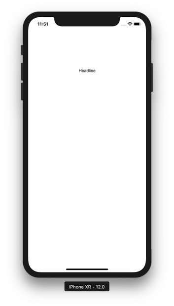
</p>

You can use system font. Replace the “label.font” line with this code:
```swift
label1.font = UIFont.systemFont(ofSize: 20, weight: .medium)
```

Run it and you would get this screen:
<p align="center">
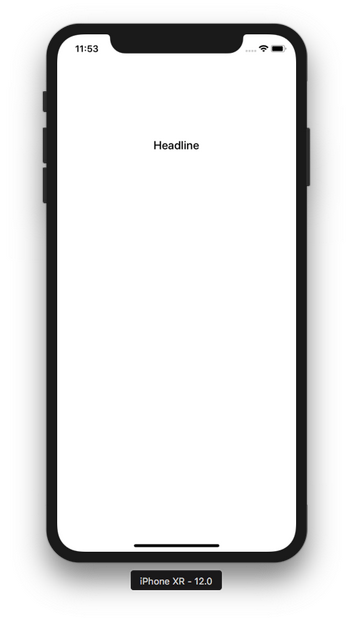
</p>

The way we set the font is a static way. The size of the font can not be changed by the user using Accessibility setting. You can link font to dynamic type so later the font size can be changed by the user using Accessibility setting.

Let’s create another label. Add this code:
```swift
        let label2 : UILabel = UILabel(frame: CGRect(x: 0, y: 0, width: 0, height: 0))
        label2.text = "Large Body1\nLarge Body2"
        label2.numberOfLines = 2
        label2.translatesAutoresizingMaskIntoConstraints = false
        label2.font = UIFont.preferredFont(forTextStyle: .headline)
        label2.adjustsFontForContentSizeCategory = true
        self.view.addSubview(label2)
        let anchor3 = label2.topAnchor.constraint(equalTo: label1.bottomAnchor, constant: 0)
        let anchor4 = label2.centerXAnchor.constraint(equalTo: self.view.centerXAnchor)
        NSLayoutConstraint.activate([anchor3, anchor4])
```

Run it and you would get this screen.
<p align="center">
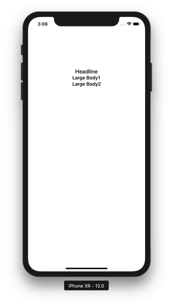
</p>

If you want UILabel to display more than one line, you must set the line number explicitly.
```swift
        label2.numberOfLines = 2
```

Now open “Accessibility Inspector”. Go to “Open Developer Tool”.
<p align="center">
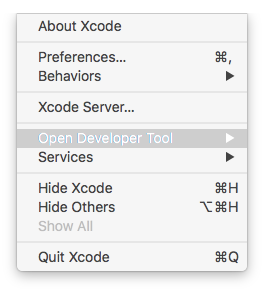
</p>

Then click “Accessibility Inspector”.
<p align="center">
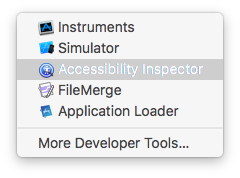
</p>

You would get “Accessibility Inspector” window.
<p align="center">
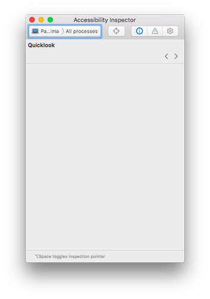
</p>

Select simulator in the window.
<p align="center">
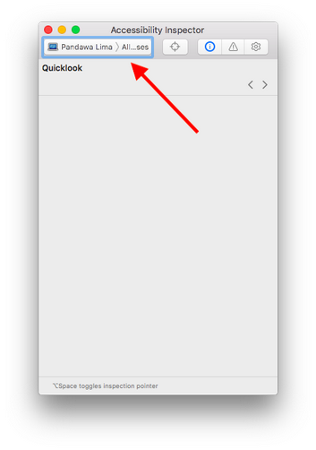
</p>

<p align="center">
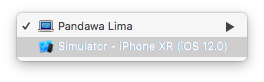
</p>

Then click “Settings” icon.
<p align="center">
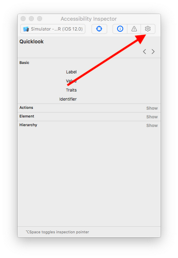
</p>

Finally change the font size in this screen.
<p align="center">
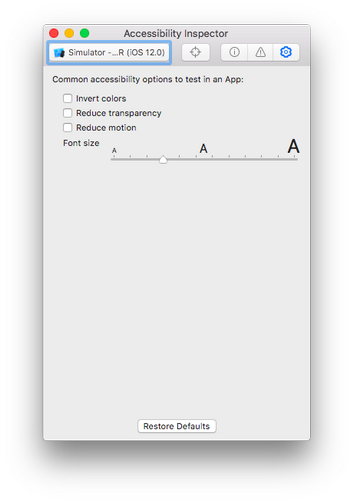
</p>

When you change the font size, the text on second label would change its size too.
<p align="center">
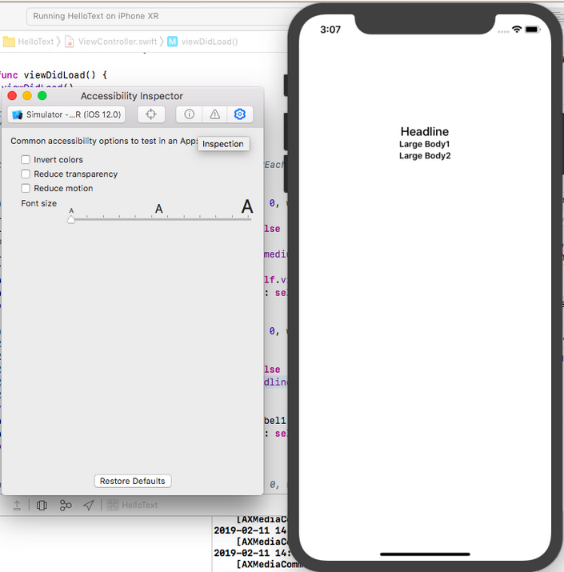
</p>

<p align="center">
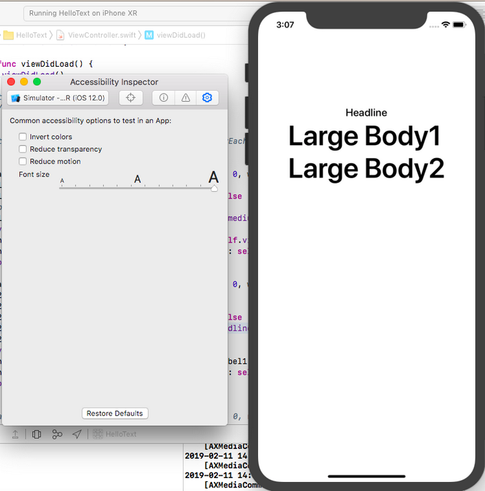
</p>

The way we link font to dynamic type is this code:
```swift
        label2.font = UIFont.preferredFont(forTextStyle: .headline)
```

Rather than accepting font parameter, we send font text style parameter. Some possible values for font text style are:
```
.body, .callout, caption1, caption2, .footnote, .title1
```

If you use dynamic type, you are using system font. If you want to use custom font with dynamic type, here’s how to do it. Add this code:
```swift
        let label3 : UILabel = UILabel(frame: CGRect(x: 0, y: 0, width: 0, height: 0))
        label3.text = "Another Normal Label"
        label3.translatesAutoresizingMaskIntoConstraints = false
        let font = UIFont(name: "Arial-ItalicMT", size: 15)!
        label3.font = UIFontMetrics(forTextStyle: .caption1).scaledFont(for: font)
        label3.adjustsFontForContentSizeCategory = true
        self.view.addSubview(label3)
        let anchor5 = label3.topAnchor.constraint(equalTo: label2.bottomAnchor, constant: 0)
        let anchor6 = label3.centerXAnchor.constraint(equalTo: self.view.centerXAnchor)
        NSLayoutConstraint.activate([anchor5, anchor6])
```

Run it and you would get this result.
<p align="center">
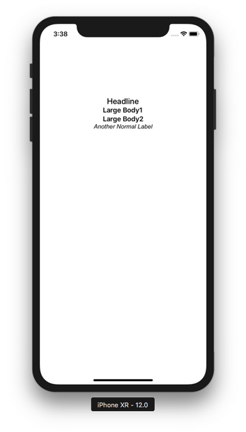
</p>

The way we set custom font with dynamic type is this code:
```swift
        let font = UIFont(name: "Arial-ItalicMT", size: 15)!
        label3.font = UIFontMetrics(forTextStyle: .caption1).scaledFont(for: font)
```

Rather than setting the italic font directly, you can also use font descriptor to do the font transformation. Add this code.
```swift
        let label4 : UILabel = UILabel(frame: CGRect(x: 0, y: 0, width: 0, height: 0))
        label4.text = "Another Normal Label"
        label4.translatesAutoresizingMaskIntoConstraints = false
        let _f = UIFont(name: "Arial", size: 15)!
        let _desc = _f.fontDescriptor
        let desc = _desc.withSymbolicTraits(.traitItalic)
        let f = UIFont(descriptor: desc!, size: 0)
        label4.font = UIFontMetrics(forTextStyle: .caption1).scaledFont(for: f)
        label4.adjustsFontForContentSizeCategory = true
        self.view.addSubview(label4)
        let anchor7 = label4.topAnchor.constraint(equalTo: label3.bottomAnchor, constant: 0)
        let anchor8 = label4.centerXAnchor.constraint(equalTo: self.view.centerXAnchor)
        NSLayoutConstraint.activate([anchor7, anchor8])
```

Run it and you would get this screen.
<p align="center">
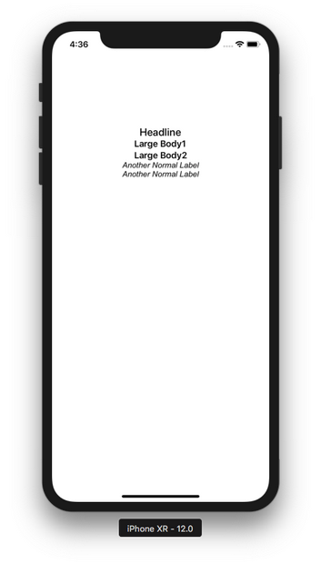
</p>

This is the way you transform the font.
```swift
        let _f = UIFont(name: "Arial", size: 15)!
        let _desc = _f.fontDescriptor
        let desc = _desc.withSymbolicTraits(.traitItalic)
        let f = UIFont(descriptor: desc!, size: 0)
```

## Base Line Constraints

Text widget has base line anchors (aside from top anchor, bottom anchor, left anchor, right anchor).

Let’s see the base line anchors in action. But replace “anchor5” line with this code to make some space.
```swift
let anchor5 = label3.topAnchor.constraint(equalTo: label2.bottomAnchor, constant: 50)
```

Then add this code:
```swift
        let label5 : UILabel = UILabel(frame: CGRect(x: 0, y: 0, width: 0, height: 0))
        label5.text = "Small Text1\nSmall Text2"
        label5.numberOfLines = 2
        label5.translatesAutoresizingMaskIntoConstraints = false
        label5.font = UIFont.preferredFont(forTextStyle: .footnote)
        label5.adjustsFontForContentSizeCategory = true
        self.view.addSubview(label5)
        let anchor9 = label5.leadingAnchor.constraint(equalTo: label2.trailingAnchor, constant: 0)
        let anchor10 = label5.firstBaselineAnchor.constraint(equalTo: label2.lastBaselineAnchor)
        NSLayoutConstraint.activate([anchor9, anchor10])
        
        let label6 : UILabel = UILabel(frame: CGRect(x: 0, y: 0, width: 0, height: 0))
        label6.text = "Small Text1\nSmall Text2"
        label6.numberOfLines = 2
        label6.translatesAutoresizingMaskIntoConstraints = false
        label6.font = UIFont.preferredFont(forTextStyle: .footnote)
        label6.adjustsFontForContentSizeCategory = true
        self.view.addSubview(label6)
        let anchor11 = label6.trailingAnchor.constraint(equalTo: label2.leadingAnchor, constant: 0)
        let anchor12 = label6.lastBaselineAnchor.constraint(equalTo: label2.firstBaselineAnchor)
        NSLayoutConstraint.activate([anchor11, anchor12])
```

The base line constraint for label5 is this code:
```swift
        let anchor10 = label5.firstBaselineAnchor.constraint(equalTo: label2.lastBaselineAnchor)
```

The base line constraint for label6 is this code:
```swift
        let anchor12 = label6.lastBaselineAnchor.constraint(equalTo: label2.firstBaselineAnchor)
```

label2 has two lines of text (“Large Body1\nLarge Body2”). label5 has two lines of text (“Small Text1\nSmall Text2”). Label6 has two lines of text (“Small Text1\nSmall Text2”).

firstBaselineAnchor is the baseline of the first line of the text view. lastBaselineAnchor is the baseline of the second line of the text view.

Run the code and you would get this screen.
<p align="center">
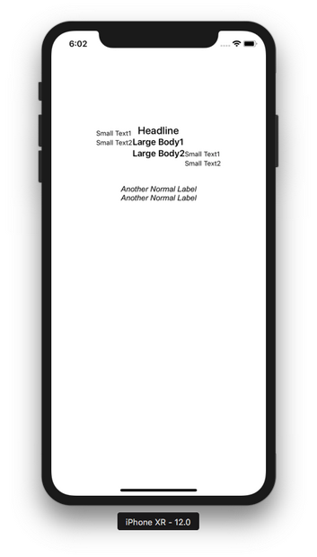
</p>

“Large Body2” is the last baseline of label2. “Large Body1” is the first baseline of label2. “Small Text1” is the first baseline of label5 and label6. “Small Text2” is the last baseline of label5 and label6.

## Content Compression Resistance and Content Hugging

Whether the text view is shrunk or stretched depends on the width constraint priority, content compression resistance priority, and content hugging priority.

Add this code:
```swift
        let priority1 = UILayoutPriority(1000)
        let priority2 = UILayoutPriority(999)
        let priority3 = UILayoutPriority(998)
        
        let label7 : UILabel = UILabel(frame: CGRect(x: 0, y: 0, width: 0, height: 0))
        label7.text = "Long Label Long Label"
        label7.translatesAutoresizingMaskIntoConstraints = false
        self.view.addSubview(label7)
        let anchor13 = label7.topAnchor.constraint(equalTo: label4.bottomAnchor, constant: 40)
        let anchor14 = label7.centerXAnchor.constraint(equalTo: self.view.centerXAnchor)
        let anchor15 = label7.widthAnchor.constraint(equalToConstant: 100)
        anchor15.priority = priority2
        label7.setContentCompressionResistancePriority(priority1, for: .horizontal)
        //label7.setContentCompressionResistancePriority(priority3, for: .horizontal)
        NSLayoutConstraint.activate([anchor13, anchor14, anchor15])
```

Run it and you would get this screen.
<p align="center">
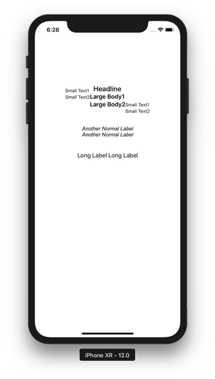
</p>

The width of the label is 100 as can be seen in this code:
```swift
        let anchor15 = label7.widthAnchor.constraint(equalToConstant: 100)
```

It’s not enough to display the whole text on the label but as we can see, the text on the label is displayed fully. It happened because the content compression resistance priority is higher than the width constraint as can be seen in this code:
```swift
        anchor15.priority = priority2
        label7.setContentCompressionResistancePriority(priority1, for: .horizontal)
```

Content compression resistance is the effort from the text view agains the shrinkage (in this case, it’s width constraint).

But if you set the priority of the width constraint is higher than the content compression resistance priority, then the text view will be shrunk. Replace “label7.setContentCompressionResistancePriority” with this code:
```swift
        label7.setContentCompressionResistancePriority(priority3, for: .horizontal)
```

Run it and you would get this screen.
<p align="center">
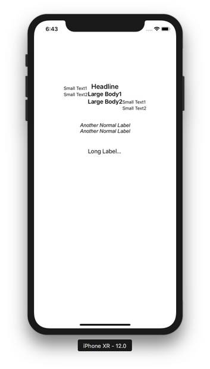
</p>

This time the text on the label is shrunk into “Long Label...” because the width constraint priority is higher than the content compression resistance priority.

There is content compression resistance and there is content hugging.

To understand content hugging, add this code:
```swift
        let label8 : UILabel = UILabel(frame: CGRect(x: 0, y: 0, width: 0, height: 0))
        label8.text = "Normal Label"
        label8.backgroundColor = .red
        label8.translatesAutoresizingMaskIntoConstraints = false
        self.view.addSubview(label8)
        let anchor16 = label8.topAnchor.constraint(equalTo: label7.bottomAnchor, constant: 20)
        let anchor17 = label8.centerXAnchor.constraint(equalTo: self.view.centerXAnchor)
        let anchor18 = label8.widthAnchor.constraint(equalToConstant: 400)
        anchor18.priority = priority2
        label8.setContentHuggingPriority(priority3, for: .horizontal)
        NSLayoutConstraint.activate([anchor16, anchor17, anchor18])
```

Run it and you would get this screen.
<p align="center">
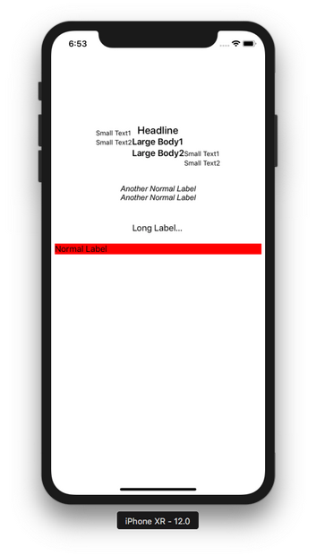
</p>

The text view is stretched more than the width of the content (“Normal Label”) because the width constraint priority is higher than the content hugging priority. Then change “label8.setContentHuggingPriority” line to this code:
```swift
        label8.setContentHuggingPriority(priority1, for: .horizontal)
```

Run it and you would get this result.
<p align="center">
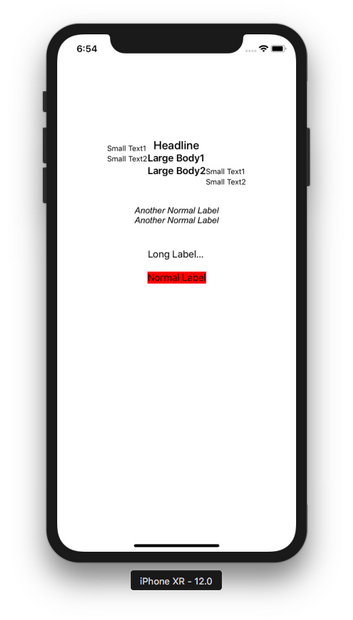
</p>

Now the width of the text view is as wide as the width of the content (“Normal Label”) because the content hugging priority is higher than the width constraint priority.

AttributedString

You could set the attribute string to the label like this:
```swift
        label8.text = "Normal Label"
        label8.backgroundColor = .red
```

or you could just use attributed string. Let’s add this code:
```swift
        let s1 = """
            Lorem ipsum dolor sit amet, consectetur adipiscing elit, sed do eiusmod tempor incididunt ut labore et dolore magna aliqua.
            """
        let content = NSAttributedString(string: s1, attributes:[
            .font: UIFont.systemFont(ofSize: 20, weight: .medium),
            .foregroundColor: UIColor(red: 0.251, green: 0.000, blue: 0.502, alpha: 1)
            ])
        let label9 : UILabel = UILabel(frame: CGRect(x: 0, y: 0, width: 0, height: 0))
        label9.translatesAutoresizingMaskIntoConstraints = false
        label9.attributedText = content
        label9.numberOfLines = 0
        self.view.addSubview(label9)
        let anchor19 = label9.topAnchor.constraint(equalTo: label8.bottomAnchor, constant: 20)
        let anchor20 = label9.centerXAnchor.constraint(equalTo: self.view.centerXAnchor)
        let anchor21 = label9.widthAnchor.constraint(equalToConstant: 200)
        NSLayoutConstraint.activate([anchor19, anchor20, anchor21])
```

<p align="center">
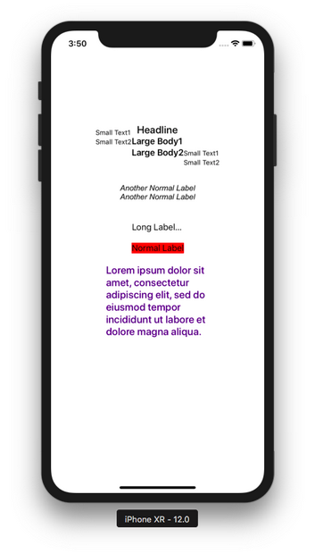
</p>

You created an attributed string:
```swift
        let content = NSAttributedString(string: s1, attributes:[
            .font: UIFont.systemFont(ofSize: 20, weight: .medium),
            .foregroundColor: UIColor(red: 0.251, green: 0.000, blue: 0.502, alpha: 1)
            ])
```

Then you set it this attributed string to attributedText property of the label.
```swift
        label9.attributedText = content
```

You don’t need to set the text property of the label anymore.

Because our text is quite long, and we have width constraint, then we need to tell the label how many lines the label has.
```swift
        label9.numberOfLines = 0
```

0 means there is no limit of number of lines.

If the number of lines is 1, the text will be truncated like this:
<p align="center">
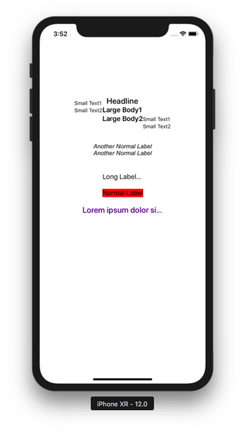
</p>

That happened because we still have our width constraint:
```swift
        let anchor21 = label9.widthAnchor.constraint(equalToConstant: 200)
```

If we remove the width constraint, we would get something like this:
<p align="center">
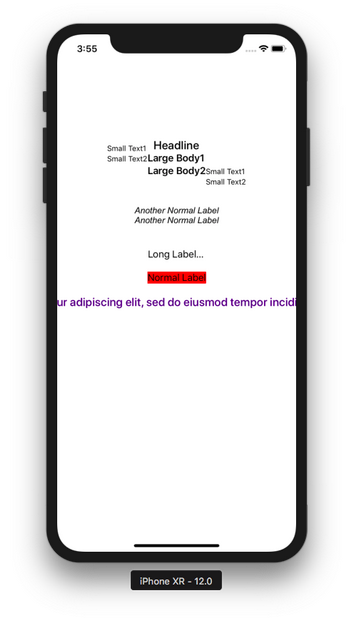
</p>

There is NSAttributedString and there is NSMutableAttributedString. With NSMutableAttributedString you could add attribute to the attributed string. This is useful if you want to have different styles on one string.

Add this code:
```swift
        let content2 = NSMutableAttributedString(string: s1, attributes:[
            .font: UIFont.systemFont(ofSize: 20, weight: .medium),
            .foregroundColor: UIColor(red: 0.251, green: 0.000, blue: 0.502, alpha: 1)
            ])
        let label10 : UILabel = UILabel(frame: CGRect(x: 0, y: 0, width: 0, height: 0))
        label10.translatesAutoresizingMaskIntoConstraints = false
        
        let r = (content.string as NSString).range(of: "consectetur adipiscing elit")
        content2.addAttributes([
            .strokeColor: UIColor.red,
            .strokeWidth: -2.0,
            .backgroundColor: UIColor.yellow,
            .strikethroughStyle: NSUnderlineStyle.single.rawValue
            ], range: r)
        
        label10.attributedText = content2
        label10.numberOfLines = 0
        self.view.addSubview(label10)
        let anchor22 = label10.topAnchor.constraint(equalTo: label9.bottomAnchor, constant: 20)
        let anchor23 = label10.centerXAnchor.constraint(equalTo: self.view.centerXAnchor)
        let anchor24 = label10.widthAnchor.constraint(equalToConstant: 400)
        NSLayoutConstraint.activate([anchor22, anchor23, anchor24])
```

Run it and you would get this screen.
<p align="center">
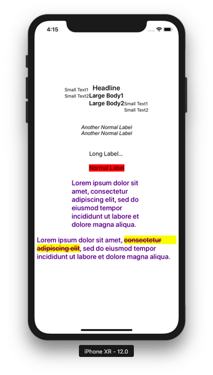
</p>

You created NSMutableAttributedString.
```swift
        let content2 = NSMutableAttributedString(string: s1, attributes:[
            .font: UIFont.systemFont(ofSize: 20, weight: .medium),
            .foregroundColor: UIColor(red: 0.251, green: 0.000, blue: 0.502, alpha: 1)
            ])
```

Then you add attributes to it.
```swift
        let r = (content.string as NSString).range(of: "consectetur adipiscing elit")
        content2.addAttributes([
            .strokeColor: UIColor.red,
            .strokeWidth: -2.0,
            .backgroundColor: UIColor.yellow,
            .strikethroughStyle: NSUnderlineStyle.single.rawValue
            ], range: r)
```

You can not do this with NSAttributedString.

If the student is wondering about this line:
```swift
        let r = (content.string as NSString).range(of: "consectetur adipiscing elit")
```

String and NSString is similar. NSString is legacy String class so sometimes some API expects NSString. In this line, we searched the NSRange of substring inside our main string because addAttributes method expect NSRange, not Range.

If your string is long and you want to style it like a paragraph (for example justifying it), you can use NSMutableParagraphStyle. Add this code:
```swift
        let para = NSMutableParagraphStyle()
        para.headIndent = 20
        para.firstLineHeadIndent = 20
        para.lineBreakMode = .byWordWrapping
        para.alignment = .justified
        para.paragraphSpacing = 10
        content2.addAttribute(.paragraphStyle, value: para, range:NSMakeRange(0, 1))
        let label11 : UILabel = UILabel(frame: CGRect(x: 0, y: 0, width: 0, height: 0))
        label11.translatesAutoresizingMaskIntoConstraints = false
        label11.attributedText = content2
        label11.numberOfLines = 0
        self.view.addSubview(label11)
        let anchor25 = label11.topAnchor.constraint(equalTo: label10.bottomAnchor, constant: 20)
        let anchor26 = label11.centerXAnchor.constraint(equalTo: self.view.centerXAnchor)
        let anchor27 = label11.widthAnchor.constraint(equalToConstant: 400)
        NSLayoutConstraint.activate([anchor25, anchor26, anchor27])
```

Run it and you would get this screen:
<p align="center">
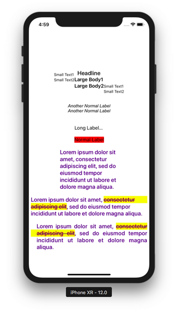
</p>

This is the way you created a paragraph style.
```swift
        let para = NSMutableParagraphStyle()
        para.headIndent = 20
        para.firstLineHeadIndent = 20
        para.lineBreakMode = .byWordWrapping
        para.alignment = .justified
        para.paragraphSpacing = 10
        content2.addAttribute(.paragraphStyle, value: para, range:NSMakeRange(0, 1))
```

To add paragraph attribute style, you just set it to the first character (NSMakeRange(0, 1)).

You can add image inside the text. Add this code:
```swift
        let s2 = "Pencil"
        let content3 = NSMutableAttributedString(string: s2)
        let pencil = UIImage(named: "pencil")!
        let pencilatt = NSTextAttachment()
        pencilatt.image = pencil
        pencilatt.bounds = CGRect(x: 0, y: 0, width: pencil.size.width, height: pencil.size.height)
        let pencilattchar = NSAttributedString(attachment: pencilatt)
        let r2 = (content3.string as NSString).range(of: "Pencil")
        content3.insert(pencilattchar, at:(r2.location + r2.length))
        
        let label12 : UILabel = UILabel(frame: CGRect(x: 0, y: 0, width: 0, height: 0))
        label12.translatesAutoresizingMaskIntoConstraints = false
        label12.attributedText = content3
        self.view.addSubview(label12)
        let anchor28 = label12.topAnchor.constraint(equalTo: self.view.topAnchor, constant: 60)
        let anchor29 = label12.centerXAnchor.constraint(equalTo: self.view.centerXAnchor)
        let anchor30 = label12.widthAnchor.constraint(equalToConstant: 200)
        NSLayoutConstraint.activate([anchor28, anchor29, anchor30])
```

The way you add image to a string is this code:
```swift
        let s2 = "Pencil"
        let content3 = NSMutableAttributedString(string: s2)
        let pencil = UIImage(named: "pencil")!
        let pencilatt = NSTextAttachment()
        pencilatt.image = pencil
        pencilatt.bounds = CGRect(x: 0, y: 0, width: pencil.size.width, height: pencil.size.height)
        let pencilattchar = NSAttributedString(attachment: pencilatt)
        let r2 = (content3.string as NSString).range(of: "Pencil")
        content3.insert(pencilattchar, at:(r2.location + r2.length))
```

But of course you must add an image named pencil.png into Assets.xcassets.

Run it and you would get this screen. Notice the pencil image on the top of the screen.
<p align="center">
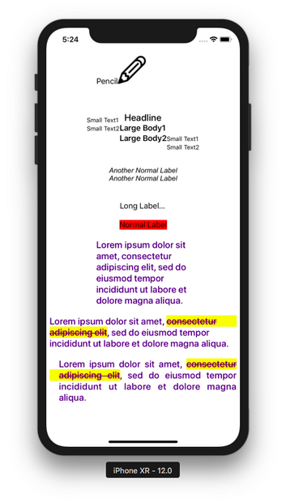
</p>

If you want to do something when the font size is changed (for example: changing the layout of some views), you can intercept it with traitCollectionDidChange method. Add this code inside ViewController class.
```swift
    override func traitCollectionDidChange(_ previousTraitCollection: UITraitCollection?) {
        print(traitCollection.preferredContentSizeCategory)
        print(previousTraitCollection?.preferredContentSizeCategory as Any)
    }
```

Run it then try to change the font size. You would get the current content size category and the previous content size category in the stdout.

## UITextField

To receive input from user, you can use UITextField.

Add this code:
```swift
        let tf : UITextField = UITextField(frame: CGRect(x: 0, y: 0, width: 0, height: 0))
        tf.tag = 1
        tf.borderStyle = .roundedRect
        tf.font = UIFont.systemFont(ofSize: 15)
        tf.autocorrectionType = .no
        tf.keyboardType = .asciiCapable
        tf.returnKeyType = .default
        tf.clearButtonMode = .whileEditing
        let iv  = UIImageView()
        let img = UIImage(named: "pencil")!
        iv.image = img
        iv.contentMode = .left
        tf.leftView = iv
        tf.leftViewMode = .unlessEditing
        tf.translatesAutoresizingMaskIntoConstraints = false
        //tf.delegate = self
        self.view.addSubview(tf)
        let anchor1 = tf.topAnchor.constraint(equalTo: self.view.topAnchor, constant: 100)
        let anchor2 = tf.centerXAnchor.constraint(equalTo: self.view.centerXAnchor)
        let anchor3 = tf.widthAnchor.constraint(equalToConstant: 200)
        NSLayoutConstraint.activate([anchor1, anchor2, anchor3])
```

Run it and you would get this screen.
<p align="center">
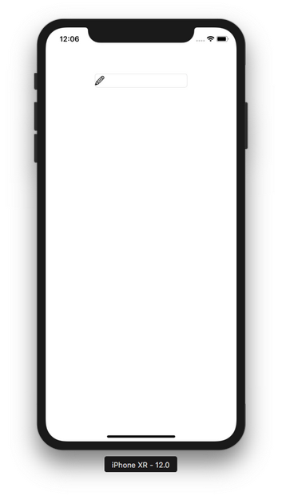
</p>

You can type the text on the text field.
<p align="center">
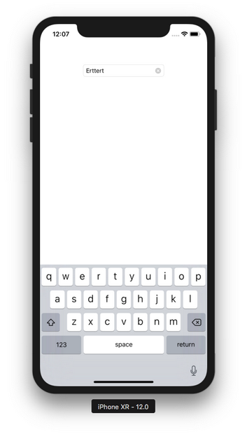
</p>

If the keyboard does not show up, you can turn it on.
<p align="center">
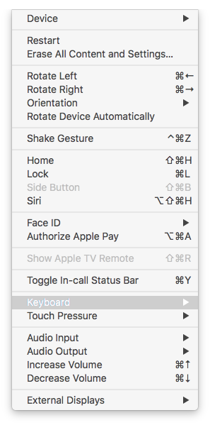
</p>

<p align="center">
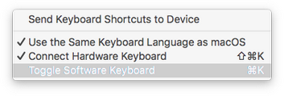
</p>

You can configure the text field with varieties of properties.
```swift
        let tf : UITextField = UITextField(frame: CGRect(x: 0, y: 0, width: 0, height: 0))
        tf.tag = 1
        tf.borderStyle = .roundedRect
        tf.font = UIFont.systemFont(ofSize: 15)
        tf.autocorrectionType = .no
        tf.keyboardType = .asciiCapable
        tf.returnKeyType = .default
        tf.clearButtonMode = .whileEditing
```

The tag property is to differentiate the text field in the callback (which we will discuss about it later). The borderStyle property is to decide the border of the text field. The font property is to set the font in the text inside the text field. The autocorrectionType is a property on which you want the text inside the text field to be autocorrected or not. The keyboardType is the type of keyboard. The returnKeyType is the type of return key on the keyboard. The clearButtonMode is a button on the right corner of the text field to clear the text on the text field.

Then there are properties on which you can put some images.
```swift
        let iv  = UIImageView()
        let img = UIImage(named: "pencil")!
        iv.image = img
        iv.contentMode = .left
        tf.leftView = iv
        tf.leftViewMode = .unlessEditing
```

The above code is to create a view (for example: an image view) inside the text field. In our case, it is an image of pencil.

The text field has an intrinsic height so we don’t have to set the height of the text field.
```swift
        let anchor1 = tf.topAnchor.constraint(equalTo: self.view.topAnchor, constant: 100)
        let anchor2 = tf.centerXAnchor.constraint(equalTo: self.view.centerXAnchor)
        let anchor3 = tf.widthAnchor.constraint(equalToConstant: 200)
        NSLayoutConstraint.activate([anchor1, anchor2, anchor3])
```

If you want to validate the text inside the text field, if you want to dismiss the keyboard, if you want to get the text after typing on the text field, you need to add callbacks and use delegation to access the callbacks.

First, make sure ViewController is a class of UITextFieldDelegate. 
```swift
class ViewController: UIViewController, UITextFieldDelegate
```

Then set the delegate of the text field to ViewController.
```swift
        tf.delegate = self
```

Then you can add the callbacks related with the text field.
```swift
    func textFieldShouldReturn(_ textField: UITextField) -> Bool {
        textField.resignFirstResponder()
        return false
    }

    func textFieldDidBeginEditing(_ textField: UITextField) {
        print("begin")
        print(textField.tag)
    }
    
    func textFieldDidEndEditing(_ textField: UITextField, reason: UITextField.DidEndEditingReason) {
        print("end")
    }
    
    func textField(_ textField: UITextField, shouldChangeCharactersIn range: NSRange, replacementString string: String) -> Bool {
        if string.isEmpty {
            return true
        }
        
        let decimalCharacters = CharacterSet.decimalDigits
        
        let decimalRange = string.rangeOfCharacter(from: decimalCharacters)
        
        if decimalRange != nil {
            return false
        }
        
        let lc = string
        textField.insertText(lc)
        return true
    }
```

The textFieldShouldReturn method is called when you click Return button. Inside the method, we called textField.resignFirstResponder(). This will dismiss the keyboard.

The textFieldDidBeginEditing method is called when you start typing on the text field.

The textFieldDidEndEditing method is called when you end typing on the text field. You use this method to store the text inside the variable.

The textField method is called when you want to override the text you type on the text field. In our case, you can not type number inside the text field.

## Text View

The text view is a hybrid between the label and the text field. If it is editable, it can be an input like the text field. But it has other properties that the text field does not have. If it is not editable, it can be a view which displays the text like the label. But it has other properties that the label does not have.

Add this code:
```swift
        let tv : UITextView = UITextView(frame: CGRect(x: 0, y: 0, width: 0, height: 0))
        tv.tag = 1
        let s = """
            Ini nomor telponnya: +628888888888.
            Besok cuaca bakal cerah. Indah sekali.
            Benar-benar indah.
            Ayo, pergi ke Liputan6 untuk baca berita.
        """
        let content = NSMutableAttributedString(string: s, attributes:[
            .font: UIFont.systemFont(ofSize: 20, weight: .medium),
            .foregroundColor: UIColor(red: 0.251, green: 0.000, blue: 0.502, alpha: 1)
            ])
        let r = (content.string as NSString).range(of: "Liputan6")
        content.addAttribute(.link, value: "https://liputan6.com", range: r)
        let r2 = (content.string as NSString).range(of: "+628888888888")
        content.addAttribute(.link, value: "tel:+628888888888", range: r2)
        tv.attributedText = content
        tv.layer.borderWidth = 1
        tv.layer.borderColor = UIColor.lightGray.cgColor
        tv.isEditable = false
        tv.isSelectable = true
        //tv.delegate = self
        tv.translatesAutoresizingMaskIntoConstraints = false
        self.view.addSubview(tv)
        let anchor4 = tv.topAnchor.constraint(equalTo: tf.bottomAnchor, constant: 100)
        let anchor5 = tv.centerXAnchor.constraint(equalTo: self.view.centerXAnchor)
        let anchor6 = tv.widthAnchor.constraint(equalToConstant: 250)
        let anchor7 = tv.heightAnchor.constraint(equalToConstant: 300)
        NSLayoutConstraint.activate([anchor4, anchor5, anchor6, anchor7])
```

Run it and you would get this screen.
<p align="center">
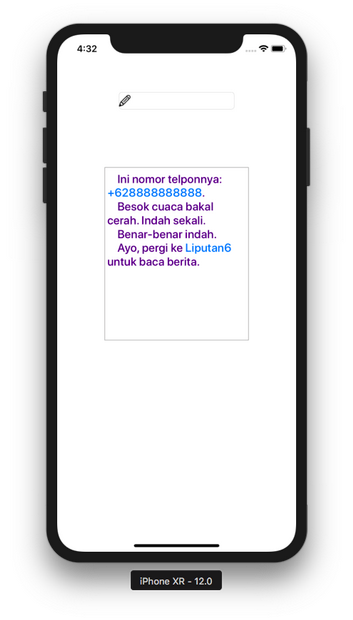
</p>

If you click “Liputan6” string by one tap, it will launch a browser. If you click “+628888888888”, it will launch Messages application.

This is the code to add the text view.
```swift
        let tv : UITextView = UITextView(frame: CGRect(x: 0, y: 0, width: 0, height: 0))
        tv.tag = 1
        let s = """
            Ini nomor telponnya: +628888888888.
            Besok cuaca bakal cerah. Indah sekali.
            Benar-benar indah.
            Ayo, pergi ke Liputan6 untuk baca berita.
        """
        let content = NSMutableAttributedString(string: s, attributes:[
            .font: UIFont.systemFont(ofSize: 20, weight: .medium),
            .foregroundColor: UIColor(red: 0.251, green: 0.000, blue: 0.502, alpha: 1)
            ])
        let r = (content.string as NSString).range(of: "Liputan6")
        content.addAttribute(.link, value: "https://liputan6.com", range: r)
        let r2 = (content.string as NSString).range(of: "+628888888888")
        content.addAttribute(.link, value: "tel:+628888888888", range: r2)
        tv.attributedText = content
        tv.layer.borderWidth = 1
        tv.layer.borderColor = UIColor.lightGray.cgColor
        tv.isEditable = false
        tv.isSelectable = true
        //tv.delegate = self
        tv.translatesAutoresizingMaskIntoConstraints = false
        self.view.addSubview(tv)
        let anchor4 = tv.topAnchor.constraint(equalTo: tf.bottomAnchor, constant: 100)
        let anchor5 = tv.centerXAnchor.constraint(equalTo: self.view.centerXAnchor)
        let anchor6 = tv.widthAnchor.constraint(equalToConstant: 250)
        let anchor7 = tv.heightAnchor.constraint(equalToConstant: 300)
        NSLayoutConstraint.activate([anchor4, anchor5, anchor6, anchor7])
```

To make the link on the text view clickable, you must use link attributes on mutable attributed string, like in this code:
```swift
        let s = """
            Ini nomor telponnya: +628888888888.
            Besok cuaca bakal cerah. Indah sekali.
            Benar-benar indah.
            Ayo, pergi ke Liputan6 untuk baca berita.
        """
        let content = NSMutableAttributedString(string: s, attributes:[
            .font: UIFont.systemFont(ofSize: 20, weight: .medium),
            .foregroundColor: UIColor(red: 0.251, green: 0.000, blue: 0.502, alpha: 1)
            ])
        let r = (content.string as NSString).range(of: "Liputan6")
        content.addAttribute(.link, value: "https://liputan6.com", range: r)
        let r2 = (content.string as NSString).range(of: "+628888888888")
        content.addAttribute(.link, value: "tel:+628888888888", range: r2)
```

For phone number link, you must use “tel:” prefix in the value string.

You can configure the text view using its properties.
```swift
        tv.attributedText = content
        tv.layer.borderWidth = 1
        tv.layer.borderColor = UIColor.lightGray.cgColor
        tv.isEditable = false
        tv.isSelectable = true
```

The text view does not have intrinsic size so the size (width and height) must be set explicitly like in this code.
```swift
        self.view.addSubview(tv)
        let anchor4 = tv.topAnchor.constraint(equalTo: tf.bottomAnchor, constant: 100)
        let anchor5 = tv.centerXAnchor.constraint(equalTo: self.view.centerXAnchor)
        let anchor6 = tv.widthAnchor.constraint(equalToConstant: 250)
        let anchor7 = tv.heightAnchor.constraint(equalToConstant: 300)
        NSLayoutConstraint.activate([anchor4, anchor5, anchor6, anchor7])
```

The text view got its own callback and delegation. Make ViewController a class of UITextViewDelegate.
```swift
class ViewController: UIViewController, UITextFieldDelegate, UITextViewDelegate
```

Then set the delegate property of the text view to ViewController.
```swift
        tv.delegate = self
```

Then you can add this method.
```swift
    func textView(_ textView: UITextView, shouldInteractWith URL: URL, in characterRange: NSRange, interaction: UITextItemInteraction) -> Bool {
        print(URL)
        print(interaction)
        return true
    }
```

This method is to intercept the clicking action on link substring on the string (“Liputan6” and “+628888888888”).

The text view has methods that are similar to the text field’s. For example if the text field has textFieldDidEndEditing, the text view has textViewDidEndEditing.

To make this method works, the text view must be editable.
```swift
        tv.isEditable = true
```

Then add this method.
```swift
    func textViewDidEndEditing(_ textView: UITextView) {
        print(textView.text)
    }
```

# Optional Reading

https://developer.apple.com/documentation/uikit/uifontdescriptor
https://developer.apple.com/documentation/uikit/uifonttextstyle


# Exercise

1. Create a screen which is composed of four labels, three text fields, and one text view.
<p align="center">
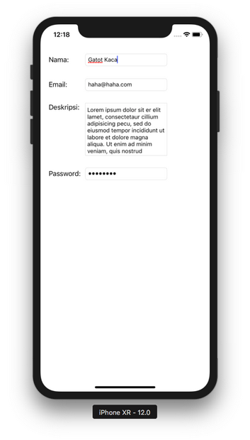
</p>

The password text field must be masked with black dot. The text view must have a border. The email text field must have “@” character before the user dismisses the keyboard.