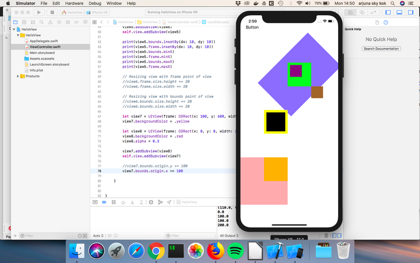

# View

View is what we see on iOS app. Anything can be seen on iOS app is View or child of View. The class name of View is UIView.

</i>Note to Teacher</i>

In iOS programming, students must be given motivation to be not afraid constructing UI from the code. Sometimes to achieve something, it’s only possible to do it in code instead of designing UI in Xcode. Most of the time, though, we use UI designer in XCode to design app.

## Objective

- Understanding basic of UIView
- Understanding frame and bounds
- Understanding basic transformations

## Creating a simple application containing UIView

Open XCode, then create a single view app. Then open ViewController.swift.
<p align="center">

</p>

<p align="center">

</p>

<p align="center">

</p>

<p align="center">

</p>

In ViewController.swift, type this inside viewDidLoad method after super.viewDidLoad() statement.
```swift
        let viewFrame = CGRect(x: 0, y: 0, width: 100, height: 100)
        let view = UIView(frame: viewFrame)
        view.backgroundColor = .blue
        self.view.addSubview(view)
```

Run the application. We can use clicking menu or hotkey.
<p align="center">

</p>

The shortcut is Cmd + R.

**Note to teacher**

<i>Students are advised to be accustomed with shortcut. Students also are encouraged to try to experiment with API of the class which they are currently learning. In this case, UIView, they can try another color, different x and y parameters, different width and height parameters.

If they ask why we use .blue (notice the dot), not blue when giving the value to view’s background, review the lesson of enum of Swift programming language.</i>

<p align="center">

</p>

Here, our UIView accepts frame object as its argument. This frame argument determines the view’s size and location.

self.view in in self.view.addSubview(view) statement is the root view. What the root view is will be explained in other part of course.

viewDidLoad method is a method which will be called after the controller’s view has been loaded in memory. The controller in this case is ViewController’s instance.

### Documentation

When the cursor is in UIView word, students can see the documentation about UIView, by clicking 
help icon on the right panel. Students also can learn how to figure out what arguments UIView constructor accepts, by typing in a new line, “UIView(“ (without closing ‘)’) then wait. As students are able to see, UIView constructor accepts other type of argument beside frame.
<p align="center">

</p>

<p align="center">

</p>

**Note to teachers**

<i>Students are encouraged to read the official documentation about the class they are using, such as UIView.</i>

UIView is the parent of all UI control views that we use in designing app. That includes button, scrollbar, picker view, text view, etc. So these children inherit some methods from UIView. So what’s true in UIView sometimes is true in other UI control views.

Let’s add another code below self.view.addSubview(view).
```swift
        let button = UIButton(frame: viewFrame)
        button.setTitle("Button", for: UIControl.State.normal)
        button.setTitleColor(.black, for: UIControl.State.normal)
        self.view.addSubview(button)
```

Run it. We will see our button in the left corner. 
<p align="center">

</p>

As we can see, our button constructor also accepts frame argument. But remember, sometimes the children will override the method from its parent. So don’t expect everything that is true in UIView will be true in its children.

**Note to mentor**

<i>For students who are foreign to inheritance, review OOP concept.</i>

### Other API from UIView

UIView object has many methods or properties, not just backgroundColor. To see all of its methods, type in a new line, “view.” (notice the dot) and wait.
<p align="center">

</p>

Let’s use one of its method, alpha. Type below view.backgroundColor = .blue statement.
```swift
        view.backgroundColor = .blue
        view.alpha = 0.5
        self.view.addSubview(view)
```

Run it. Notice the blue color is “brighter” or more transparent.
<p align="center">

</p>

**Note to mentor**

<i>If students are confused with the concept of transparency or alphaness, the value 0 for alpha property means the object is completely transparent. The value 1 (default value) for alpha property means the object is 100% visible (or opaque). If the object is 100% transparent (value 0) then the other object behind this object is 100% visible. Students are encouraged to experiment with alpha value so they can wrap their head around this concept.</i>

### Transformation

To transform the view, we use CGAffineTransform method. Let’s transform our view. Put the code after view.alpha = 0.5.
```swift
        view.alpha = 0.5
        view.transform = CGAffineTransform(translationX: 200, y: 200)
        self.view.addSubview(view)
```

<p align="center">

</p>

Translation is moving the object. The bigger the x, the farther the view moves in right direction (as opposed to left direction). The bigger the y, the lower the view moves.

We can rotate the view. We still use CGAffineTransform. Put the code above self.view.addSubview(view).
```swift
        view.transform = CGAffineTransform(translationX: 200, y: 200)
        view.transform = CGAffineTransform(rotationAngle: .pi / 4)
        self.view.addSubview(view)
```

Run the code. The view will be rotated by 45 degrees.
<p align="center">

</p>

The rotationAngle argument is based on radians. 1 full circle is 2 pi radian.

**Note to mentor**

<i>If students are confused about radian (most people think by degrees not radians), here’s how to convert radian to degree. To rotate the view by 45 degrees, they can use this trick:</i>
```
rotationAngle: 45 * .pi / 180
```

**Note to teachers**
<i>If they are confused by the view moved back to left corner, tell them it happened because we override the previous transformation. Soon we learn how to combine more than one transformations. For curious students who are intrigued by CGAffineTransform object is, tell them it is basically linear algebra transformations. Refer them to linear algebra resources on internet. They can print this object. </i>
```
        print(CGAffineTransform(rotationAngle: .pi / 4))
        print(CGAffineTransform(translationX: 200, y: 200))
```

We can scale the object. Type the code above self.view.addSubview(view).
```swift
        view.transform = CGAffineTransform(rotationAngle: .pi / 4)
        view.transform = CGAffineTransform(scaleX: 2, y: 3)
        self.view.addSubview(view)
```

Run it. Our view will be bigger than the previous ones.
<p align="center">

</p>

Here’s how to combine all transformations. Convert these lines:
```swift
        view.alpha = 0.5
        view.transform = CGAffineTransform(translationX: 200, y: 200)
        view.transform = CGAffineTransform(rotationAngle: .pi / 4)
        view.transform = CGAffineTransform(scaleX: 2, y: 3)
        self.view.addSubview(view)
```
into:
```swift
        view.alpha = 0.5
        let t = CGAffineTransform(translationX: 200, y: 200)
        let r = CGAffineTransform(rotationAngle: .pi / 4)
        let s = CGAffineTransform(scaleX: 2, y: 3)
        view.transform = s.concatenating(r).concatenating(t)
        self.view.addSubview(view)
```

Run it. Our view will be moved, rotated, and scaled. The students must take note that the order of transformations matters. Under hood, combining transformations means matrix multiplication.In linear algebra, matrix multiplication operation is not commutative. 

This statement:
```swift
view.transform = s.concatenating(r).concatenating(t)
```

produces different result than this statement does:
```swift
view.transform = t.concatenating(r).concatenating(s)
```

The students are encouraged to experiment with order of transformations.

**Note to mentor**
<i>Tell students these transformations methods are used heavily in animation. One of the examples is removing tab in Firefox iOS app. Other example is swiping in Tinder.</i>
<p align="center">


</p>

<i>As we can see when we remove a tab in Firefox iOS app, we swipe the tab to the side. There are three transformation happening when we do that. First, translation (the view moves to the right). Second, rotation (the view is rotated). Third, alpha value is reduced (the view becomes more transparent).</i>

### Subview and Superview

Let’s create another view. Put the code on the bottom of viewDidLoad method.
```swift
        let button = UIButton(frame: viewFrame)
        button.setTitle("Button", for: UIControl.State.normal)
        button.setTitleColor(.black, for: UIControl.State.normal)
        self.view.addSubview(button)
        
        let view2 = UIView(frame: CGRect(x: 200, y: 200, width: 100, height: 100))
        view2.backgroundColor = .green
        let view3 = UIView(frame: CGRect(x: 10, y: 10, width: 50, height: 50))
        view3.backgroundColor = .purple
        let view4 = UIView(frame: CGRect(x: 300, y: 300, width: 50, height: 50))
        view4.backgroundColor = .brown
        
        view2.addSubview(view3)
        self.view.addSubview(view2)
        self.view.addSubview(view4)
```

Run it. You would get this screen.
<p align="center">

</p>

Take a look at the view with green color, purple color, and brown color. The view with purple color is the subview (or child) of the view with green color. But the x and y params in frame as argument for view with purple color is x: 10 and y: 10. Shouldn’t the view with purple color is put on the left corner.

The frame as argument in a view’s constructor refers to its superview (or parent) coordinates  NOT the root view. So x and y params, which are x: 10 and y: 10, in view with purple color’s constructor means, its position is 10 unit to the right and 10 unit to the bottom from its parent view (view with green color) NOT the root view.

Adding subviews to a view is a way to organize views in a screen. Changing one property of a view sometimes will affect all its children’s property. This will make life easier in some situations.

**Note to teachers**
<i>One of organizing views cases is when dealing with a scrollview. Sometimes instead of adding a lot of views in a scrollview, we create a view (UIView’s instance) to become a parent for all of these views then we add this view to a scrollview.</i>

### Bounds

Frame is the location and the size of a view within its superview (or parent). Bounds is the view’s internal coordinate system.

To understand the differences between frame and bounds, let’s create another views. Put the code on the bottom of viewDidLoad method.
```swift
        let view5 = UIView(frame: CGRect(x: 100, y: 400, width: 100, height: 100))
        view5.backgroundColor = .yellow
        
        let view6 = UIView(frame: view5.bounds.insetBy(dx: 10, dy: 10))
        view6.backgroundColor = .black
        
        view5.addSubview(view6)
        self.view.addSubview(view5)
```

<p align="center">

</p>

According to the official documentation from Apple, insetBy method is returns a rectangle that is smaller or larger than the source rectangle, with the same center point. So view5 has a rectangle with width 100 units and height 100 units. We want view6’s border to have 10 unit distance to view7’s border. It means the left border of view6 is 10 unit to the right of the left border of view5, the right border of view6 is 10 unit to the left of the right border of view5.

Now that the students have understood the insetBy method, notice that insetBy method is accessed from bounds property of view5, not frame property of view5.

We have to use bounds not frame in this case, because view6’s position is derived from view5’s position so that’s why we use view5.bounds (the internal coordinate system of view5). Remember frame of view6 refers to its parent view (view5) NOT to the root view. If we use view5.frame, we will refer to view5’s superview position, which is the root view!

We can print bounds and frame value to see the real differences. Put these code on the bottom of viewDidLoad method. Run the app again.
```swift
        print(view5.bounds.insetBy(dx: 10, dy: 10))
        print(view5.frame.insetBy(dx: 10, dy: 10))
        print(view5.bounds.minX)
        print(view5.frame.minX)
        print(view5.bounds.maxX)
        print(view5.frame.maxX)
```

You would get these values. 
```
(10.0, 10.0, 80.0, 80.0)
(110.0, 410.0, 80.0, 80.0)
0.0
100.0
100.0
200.0
```

The minX refers to the left x coordinate or left border’s x coordinate. The maxX refers to the right x coordinate or right border’s x coordinate.

The minX of frame of view5 is 100 because we initialize it so.
```swift
let view5 = UIView(frame: CGRect(x: 100, y: 400, width: 100, height: 100))
```

See the x argument (x: 100)? But minX of bounds of view5 is 0. And it is always 0 by default.

The interesting thing is when we resize the view. Resizing can be done from frame point of view or bounds point of view. And their results are different.

Add the code to resize the view from the frame point of view on the bottom of viewDidLoad method.
```swift
        // Resizing view with frame point of view
        view6.frame.size.height += 20
        view6.frame.size.width += 20
```

Run it and you would see that the view6 (black background) was resized to the right and to the bottom.
<p align="center">

</p>

Then comment that code out. Add this code to the bottom of viewDidLoad method.
```swift
        // Resizing view with bounds point of view
        view6.bounds.size.height += 20
        view6.bounds.size.width += 20
```

Run it. Now the view6 (black background) completely covers view5 (yellow background).
<p align="center">

</p>

If you resize the view from frame point of view, the view would take account of its parent’s coordinates. It would stretch to the right, and stretch to the bottom.
<p align="center">

</p>

If you resize the view from bounds point of view, the view is the center of the universe. It would stretch to every direction.
<p align="center">

</p>

Bounds x and y are 0 and 0 by default. But we can change it.

Comment the code which resizing view from bounds point of view. Let’s create another two views.
```swift
        let view7 = UIView(frame: CGRect(x: 100, y: 600, width: 100, height: 100))
        view7.backgroundColor = .yellow
        
        let view8 = UIView(frame: CGRect(x: 0, y: 0, width: 200, height: 200))
        view8.backgroundColor = .red
        view8.alpha = 0.3
        
        view7.addSubview(view8)
        self.view.addSubview(view7)
```

We have to add some transparency to view8 so we can see its parent (view7). Subview can be bigger than its parent.
<p align="center">

</p>

Now let’s change the y of bounds property of view7 (the parent of view8). Interesting things would happen. Add this code to the bottom of viewDidLoad method.
```swift
        view7.bounds.origin.y += 100
```

Run it and you would see that view8 (the subview of view7) would slide up to the top.
<p align="center">

</p>

The view7 itself does not change its position. But its subview (or the child) changes the position.

If we change the x of bounds property of the view, the subview would slide to the left.
```swift
        //view7.bounds.origin.y += 100
        view7.bounds.origin.x += 100
```

<p align="center">

</p>

Notice that x and y are properties of origin properties of bounds property of the view.

If students ask why would we want to change the origin of x and y of bounds property of the view, the answer is that is what UIScrollView does. view7 (yellow background) is the scrollview. view8 (red/pink background) is the thing that we scroll upon (it could be a big image that does not fit in a screen or tableview). Right now the part of view8 outside view7 can be seen because we want to demonstrate the feature. But in a scrollview the clipsToBounds property of a subview inside a scroll view will be true, meaning any part of the view outside the scrollview will be hidden.

**Note to teachers**

<i>The students must understand the difference between frame and bounds. Review it thoroughly if necessary. Repeat the teaching many times if necessary.</i>

To manipulate the location of a view, we can use frame or bounds property. But sometimes using the bounds is more convenient. Suppose we want to center the subview inside its superview. Let’s make it happens for view2 (green background) and view3 (purple background).

Add this code on the bottom of viewDidLoad method.
```swift
        view3.center = CGPoint(x: view2.bounds.midX, y: view2.bounds.midY)
```

Run it. The view3 is in the center of view2.
<p align="center">

</p>

Could you do it with frame? You can, but the calculation is not straightforward.

# Exercises

This is the initial app. The student is given this initial code in viewDidLoad method.
```swift
        // INITIAL CODE
        let view1 = UIView(frame: CGRect(x: 100, y: 100, width: 200, height: 200))
        view1.backgroundColor = .blue
        
        let view2 = UIView(frame: CGRect(x: 0, y: 0, width: 40, height: 40))
        view2.backgroundColor = .red
        
        view1.addSubview(view2)
        self.view.addSubview(view1)
        // END OF INITIAL CODE
```

<p align="center">

</p>

1. Move the red view into the top right corner of the blue view.
<p align="center">

</p>

2. Move the red view into the bottom right corner of the blue view.
<p align="center">

</p>

3. Transform the rectangle red view into the diamond red view and move it to bottom middle of the blue view.
<p align="center">

</p>

4. Delete the red view. Deleting view has not been taught in this document. But the students must find the correct method from intellisense (code completion) and/or help document in Xcode. Students must not use Google.
<p align="center">

</p>

**Note to mentor**
<i>There are many ways to Rome. There are different ways to achieve a goal in iOS programming. For example, to rotate the view by 45 degrees, we can do this:<i>
```
        view2.transform = CGAffineTransform(rotationAngle: .pi / 4)
```
or
```
        view2.transform = view2.transform.rotated(by: .pi / 4)
```

<i>Just keep that in mind. Students may come up with something creative when doing the exercises.</i>


# Other materials:

https://stackoverflow.com/questions/1210047/cocoa-whats-the-difference-between-the-frame-and-the-bounds
https://www.khanacademy.org/math/linear-algebra/matrix-transformations
https://developer.apple.com/documentation/uikit/uiview