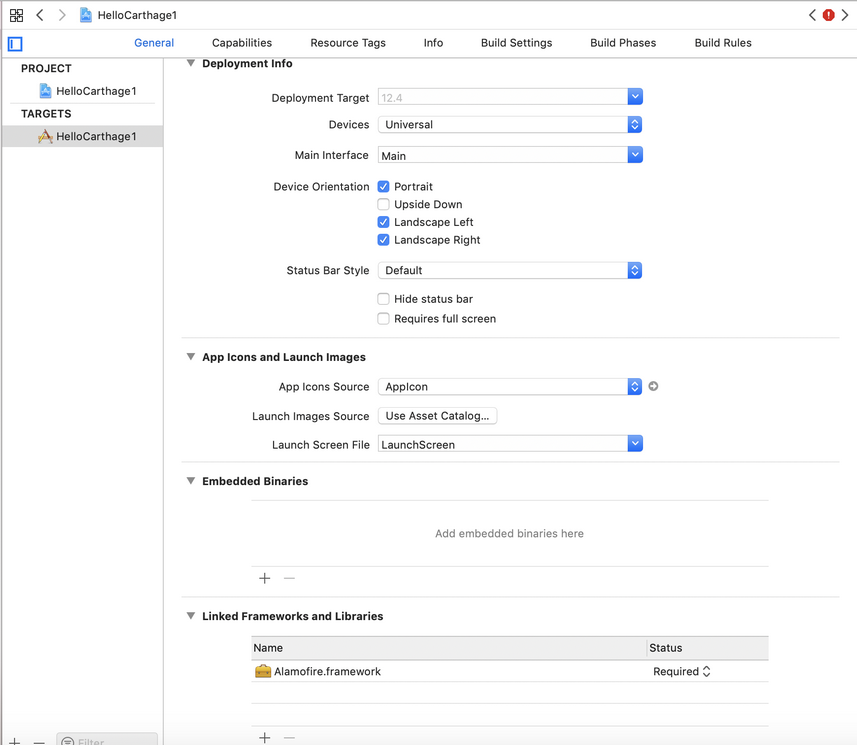
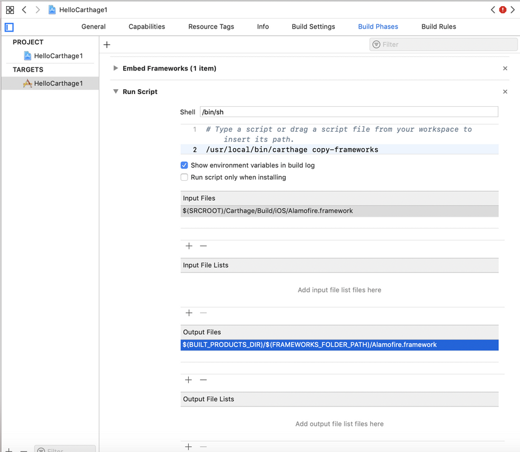
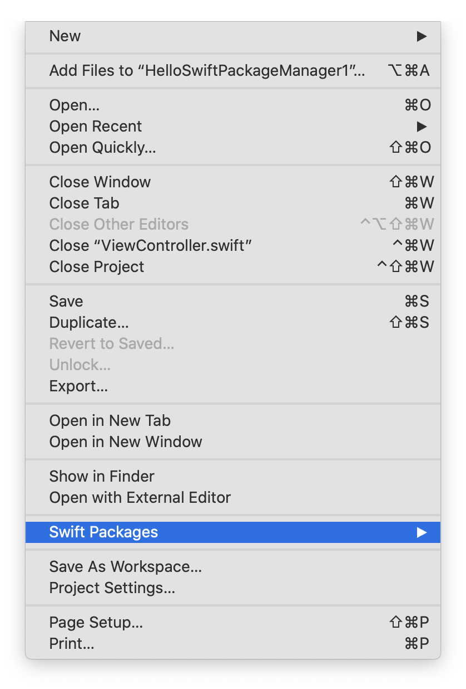
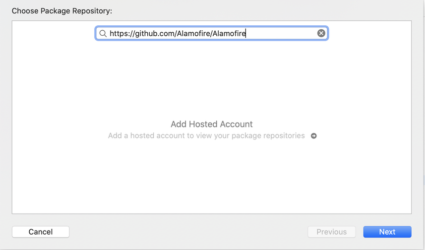
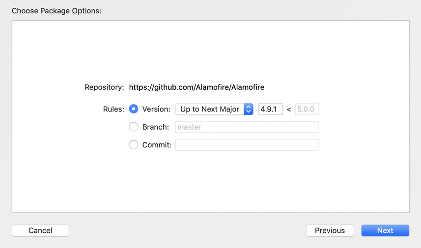
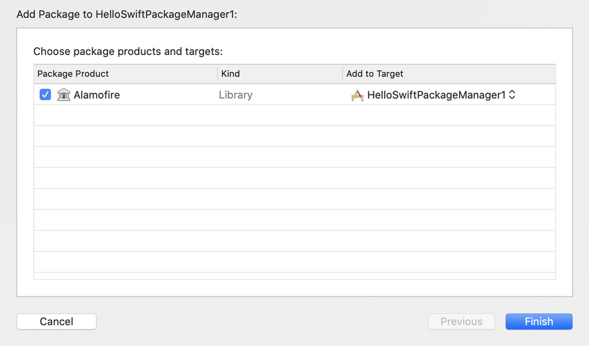

# CocoaPods and Carthage

To install third-party libraries, we can use CocoaPods, Carthage and Swift Package Manager. The latter is still in early phase.

## CocoaPods

Install cocoapods command line program.
```
$ sudo gem install cocoapods
```

Create a new single view app project. Name it HelloCocoaPod1. 

Then go inside HelloCocoaPod1 directory and initialize Podfile
```
$ pod init
```

It creates a Podfile file. Edit the file. Add one line inside target block.
```
pod 'Alamofire', '~> 5.0.0-beta.5'
```

Your Podfile will be like this.
```
# Uncomment the next line to define a global platform for your project
# platform :ios, '9.0'

target 'HelloCocoaPod1' do
  # Comment the next line if you don't want to use dynamic frameworks
  use_frameworks!

  # Pods for HelloCocoaPod1
  pod 'Alamofire', '~> 5.0.0-beta.5'

end
```

Then run this command in the command line.
```
$ pod install
```

It takes time. After installing the third-party libraries, you can use Alamofire library.

Edit HelloCocoaPod1/ViewController.swift.
```swift
import UIKit
import Alamofire


class ViewController: UIViewController {

    override func viewDidLoad() {
        super.viewDidLoad()
        // Do any additional setup after loading the view.
        
        AF.request ("https://httpbin.org/get").responseJSON { response in
            print("Request: \(String(describing: response.request))")
        }
    }

}
```

If you run the application, you can get the json response with Alamofire library.

If you add another library, just add a related line inside target block, then run ‘pod install’ again. But if you want to update the library from one version to another, you should run ‘pod update’.

If you got this error:
```
xcrun: error: unable to find utility "xcodebuild", not a developer tool or in PATH
```

Run this command:
```
$ sudo xcode-select --switch /Applications/Xcode.app/Contents/Developer/
```

Create Cartfile inside project directory.
```
github "Alamofire/Alamofire" ~> 4.7.2
```

Then run this command:
```
$ carthage update
```

Then link the Alamofire framework to Xcode. Click General tab. Then add Alamofire framework in  “Linked Frameworks and Libraries”.
<p align="center">

</p>

Then open “Build Phases” tab. Create a “Run script”.

Add this command in Shell.
```
/usr/local/bin/carthage copy-frameworks
```

Add this line in “Input Files”.
```
$(SRCROOT)/Carthage/Build/iOS/Alamofire.framework
```

Add this line in “Output Files”.
```
$(BUILT_PRODUCTS_DIR)/$(FRAMEWORKS_FOLDER_PATH)/Alamofire.framework
```

<p align="center">

</p>

Then edit HelloCarthage1/ViewController.swift.
```swift
import UIKit
import Alamofire


class ViewController: UIViewController {

    override func viewDidLoad() {
        super.viewDidLoad()
        // Do any additional setup after loading the view.
        
        AF.request ("https://httpbin.org/get").responseJSON { response in
            print("Request: \(String(describing: response.request))")
        }
    }

}
```

Run the application and you will get the json response from Alamofire library.

## Swift Package Manager

Swift Package Manager is a native way to install third party libraries starting from Xcode 11.

Create a new single view application. Name it HelloSwiftPackageManager1.

Choose File – Swift Packages – Add Package Dependency.
<p align="center">

</p>

Fill the text field with the repository of our third-party library.
<p align="center">

</p>

Press Next then choose the version or the branch or the commit of the repository.
<p align="center">

</p>

Press Next then choose the package product.
<p align="center">

</p>

Then we can use Alamofire library.

Edit ViewController.
```swift
import UIKit
import Alamofire

class ViewController: UIViewController {

    override func viewDidLoad() {
        super.viewDidLoad()
        // Do any additional setup after loading the view.
        
        Alamofire.request ("https://httpbin.org/get").responseJSON { response in
            print("Request: \(String(describing: response.request))")
        }
    }


}
```

If we ran the application, we would get this output.
```
Request: Optional(https://httpbin.org/get)
```

# Exercises

1. Install other libraries using Carthage and CocoaPods, such as Eureka, SDWebImage.