# Core Data

Usually iOS programmers don’t use SQLite directly but use interface on top of it, which is called Core Data. Core Data manages objects and its relationships.

Create a single view iOS project. Name it HelloCoreData1.

This time, we need to check “Use Core Data”.
<p align="center">
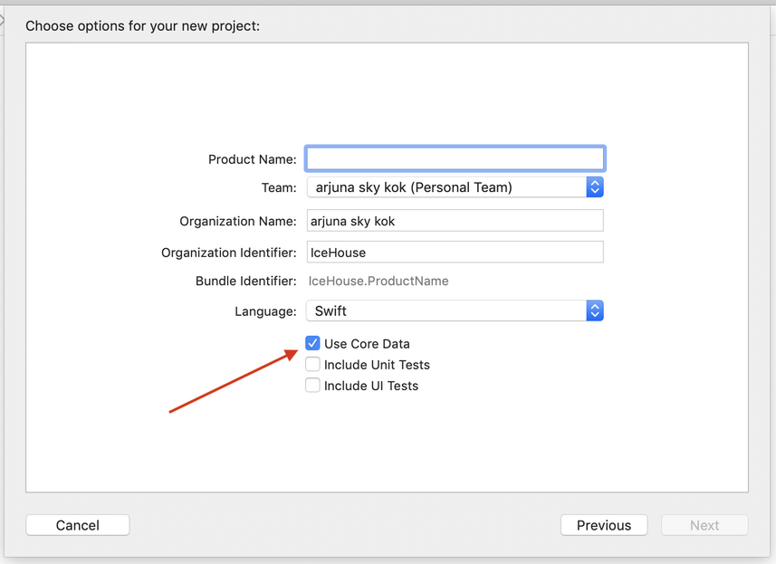
</p>

Checking “Use Core Data” when creating an iOS project will give you data model file (HelloCoreData1.xcdatamodeld) and some convenient code in AppDelegate.swift.
```swift
    // MARK: - Core Data stack

    lazy var persistentContainer: NSPersistentContainer = {
        /*
         The persistent container for the application. This implementation
         creates and returns a container, having loaded the store for the
         application to it. This property is optional since there are legitimate
         error conditions that could cause the creation of the store to fail.
        */
        let container = NSPersistentContainer(name: "HelloCoreData1")
        container.loadPersistentStores(completionHandler: { (storeDescription, error) in
            if let error = error as NSError? {
                // Replace this implementation with code to handle the error appropriately.
                // fatalError() causes the application to generate a crash log and terminate. You should not use this function in a shipping application, although it may be useful during development.
                 
                /*
                 Typical reasons for an error here include:
                 * The parent directory does not exist, cannot be created, or disallows writing.
                 * The persistent store is not accessible, due to permissions or data protection when the device is locked.
                 * The device is out of space.
                 * The store could not be migrated to the current model version.
                 Check the error message to determine what the actual problem was.
                 */
                fatalError("Unresolved error \(error), \(error.userInfo)")
            }
        })
        return container
    }()

    // MARK: - Core Data Saving support

    func saveContext () {
        let context = persistentContainer.viewContext
        if context.hasChanges {
            do {
                try context.save()
            } catch {
                // Replace this implementation with code to handle the error appropriately.
                // fatalError() causes the application to generate a crash log and terminate. You should not use this function in a shipping application, although it may be useful during development.
                let nserror = error as NSError
                fatalError("Unresolved error \(nserror), \(nserror.userInfo)")
            }
        }
    }
```

Choose HelloCoreData1.xcdatamodeld. This is our Core Data interface in Xcode.
<p align="center">
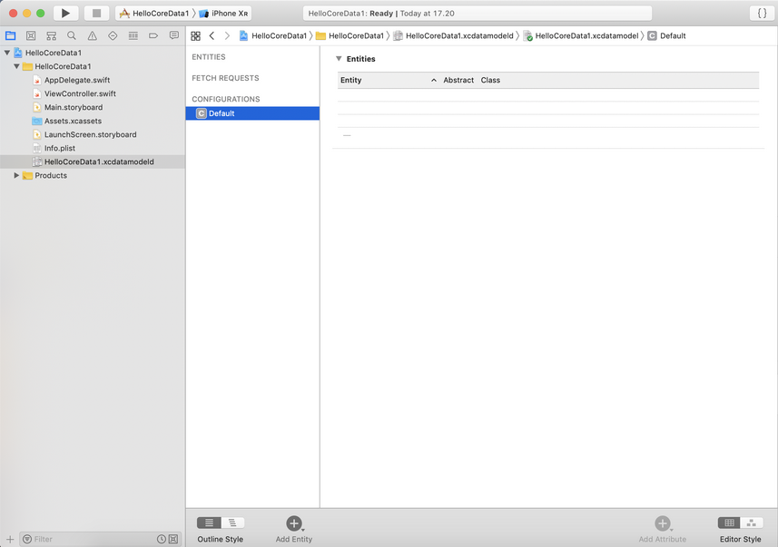
</p>

Click “Add Entity” button in bottom part of Xcode. We will get a new entity named “Entity”. Change the name to City.
<p align="center">
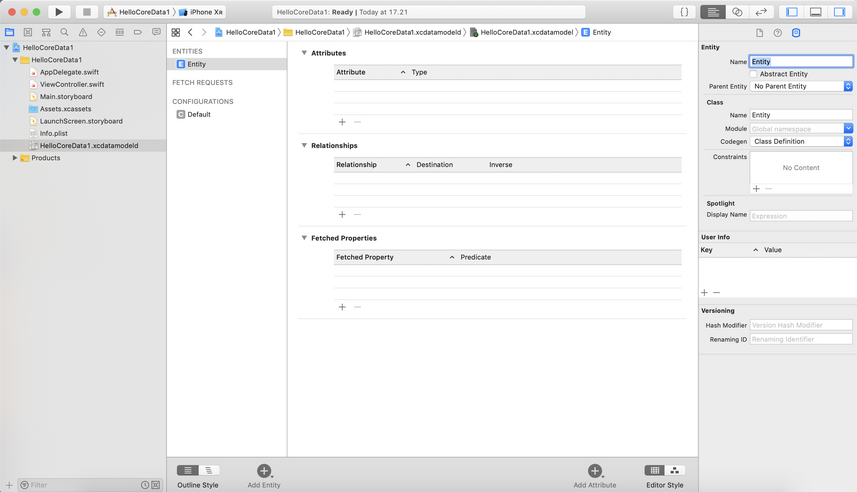
</p>

Add 3 attributes to this entity.
<p align="center">
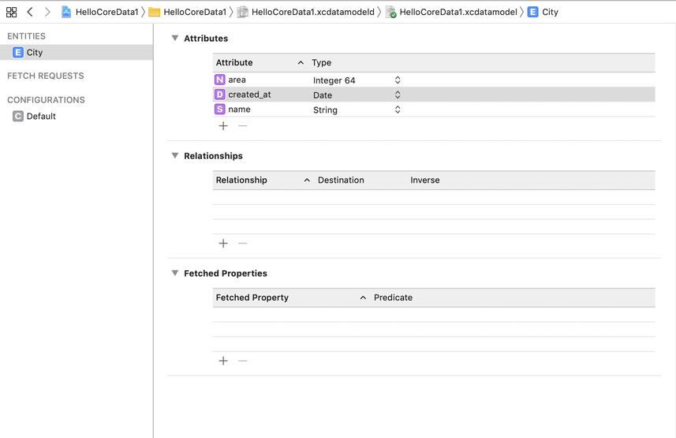
</p>

Entity is like a table if you come from database background. Attribute is like a column.

## Persistent Container View Context

Edit ViewController.swift.

Add context variable which comes from persistent container. Remember we get the defined persistent container in AppDelegate.swift because we check “Use Core Data” when we create a new iOS project. This context variable will be used when we save Core Data object from memory to file, when we request Core Data object from file to memory.
```swift
private let context = (UIApplication.shared.delegate as! AppDelegate).persistentContainer.viewContext
```

Create an array of City object. We get City object automatically after we added entity in data model file (HelloCoreData1.xcdatamodeld).
```swift
private var cities = [City]()
```

## Fetch Request Result

To do anything with Core Data objects or Entities (City in our example), we need to use fetch request result.
```swift
let request = NSFetchRequest<NSFetchRequestResult>(entityName: "City")
```

## NSBatchDeleteRequest

Let’s delete all objects (rows in database terminology).
```swift
        let deleteRequest = NSBatchDeleteRequest(fetchRequest: request)
        
        do {
            print("Deleting Data on Core Data")
            try context.execute(deleteRequest)
        } catch {
            print(error)
        }
```

We create a fetch request object with our entity, which is City.
```swift
let request = NSFetchRequest<NSFetchRequestResult>(entityName: "City")
```

Then we create a delete request.
```swift
let deleteRequest = NSBatchDeleteRequest(fetchRequest: request)
```

Finally, we execute it with our view context object.
```swift
try context.execute(deleteRequest)
```

## New Object in Core Data

Let’s create some City objects.
```swift
        let dateFormatter = DateFormatter()
        dateFormatter.dateFormat = "yyyy-MM-dd HH:mm:ss"
        
        print("Creating New Data on Core Data")
        let newRandomCity = City(context: context)
        newRandomCity.name = "Kuala Lumpur"
        newRandomCity.area = 6400
        newRandomCity.created_at = dateFormatter.date(from: "2002-02-02 14:02:00")!
```

We need to supply context variable when creating City object.
```swift
let newRandomCity = City(context: context)
```

Then we can set values to the City’s attribute by accessing the attributes like accessor.
```swift
newRandomCity.name = "Kuala Lumpur"
```

But these City objects are in memory only. To persist this object, we need to call save method from context object.
```swift
        do {
            print("Saving Data")
            try context.save()
        } catch {
            print(error)
        }
```

## Fetch Method

To get City objects from persisted file into memory, we can use fetch method from context object. We send fetch request object that we have defined previously.
```swift
        do {
            print("Using Fetch Request")
            let cities = try context.fetch(request) as! [City]
            for c in cities {
                print("City: \(c.name!) \(c.area) \(dateFormatter.string(from: c.created_at!))")
            }
        } catch {
            print(error)
        }
```

When we execute fetch method, we need to cast the result as an array of City object.
```swift
let cities = try context.fetch(request) as! [City]
```

Then you can iterate the City array object as usual.
```swift
for c in cities {
    print("City: \(c.name!) \(c.area) \(dateFormatter.string(from: c.created_at!))")
}
```

## NSSortDescriptor

If we want to sort the result from the query, we can use NSSortDescriptor.
```swift
        do {
            print("Using Sort Descriptor")
            let nameSort = NSSortDescriptor(keyPath: \City.name, ascending: true)
            request.sortDescriptors = [nameSort]
            let cities = try context.fetch(request) as! [City]
            for c in cities {
                print("City: \(c.name!) \(c.area) \(dateFormatter.string(from: c.created_at!))")
            }
        } catch {
            print(error)
        }
```

We create a sort condition we want. In this example, we want to sort the result with name of the City sorted with ascending way.
```swift
let nameSort = NSSortDescriptor(keyPath: \City.name, ascending: true)
```

Then set this sort condition to the fetch request object.
```swift
request.sortDescriptors = [nameSort]
```

Then you can fetch City objects as usual and iterate over it.

## NSPredicate

If you want to get some result not all, you can filter the result with NSPredicate.

Create a NSPredicate object and set it to fetch request object.
```swift
let dateIn2006 = dateFormatter.date(from: "2006-02-02 14:02:00")!
let cityPredicate = NSPredicate(format: "name == %@ and area > %@ and created_at > %@",
                    argumentArray: ["Lagos", 100, dateIn2006])
request.predicate = cityPredicate
```

We use two arguments in NSPredicate constructor. The first argument is format string. This is the filter condition.
```swift
format: "name == %@ and area > %@ and created_at > %@"
```

%@ will be replaced with arguments that we supply in the second argument.
```swift
argumentArray: ["Lagos", 100, dateIn2006])
```

Then we use fetch method as usual. Later we iterate the result as usual.

Run the application and we will get this result.
```
Deleting Data on Core Data
Creating New Data on Core Data
Saving Data
Using Fetch Request
City: Lagos 7800 2009-02-02 14:02:00
City: Kuala Lumpur 6400 2002-02-02 14:02:00
Using Sort Descriptor
City: Kuala Lumpur 6400 2002-02-02 14:02:00
City: Lagos 7800 2009-02-02 14:02:00
Using Predicate
City: Lagos 7800 2009-02-02 14:02:00
```

## NSFetchedResultController

There is other way to perform fetching data from Core Data, using NSFetchedResultController. This way is very convenient if it is combined with Table View.

Create a new single view project. Don’t forget to check “Use Core Data”. Name it HelloCoreData2.

Create a new Entity, named City, with attributes: area (type: Integer 64), name (type: String).
<p align="center">
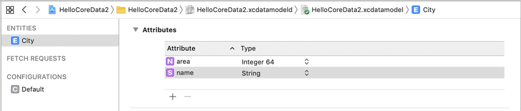
</p>

We are going to create a table view controller.

Create a new file (Cocoa Touch Class). Name it TableViewController. Make it subclass of UITableViewController.
<p align="center">
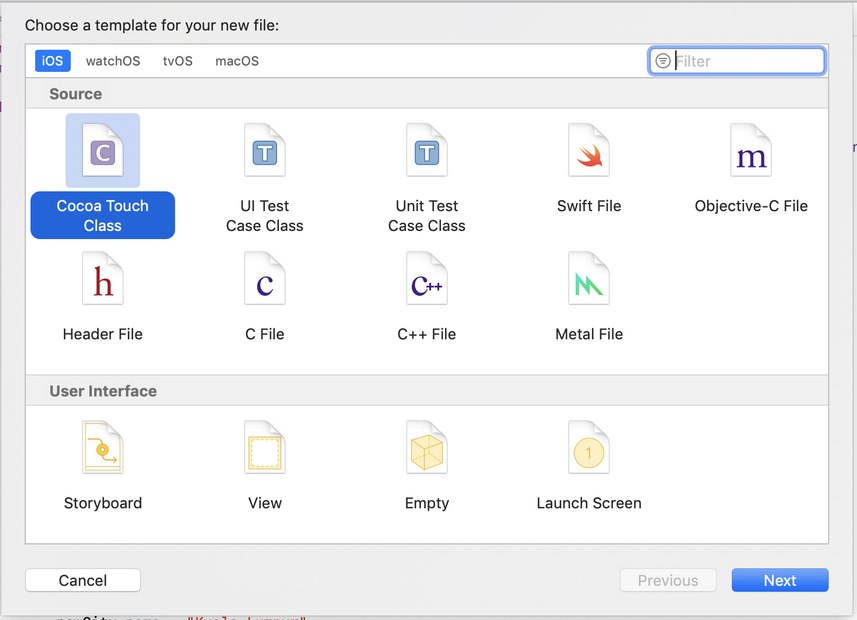
</p>

<p align="center">
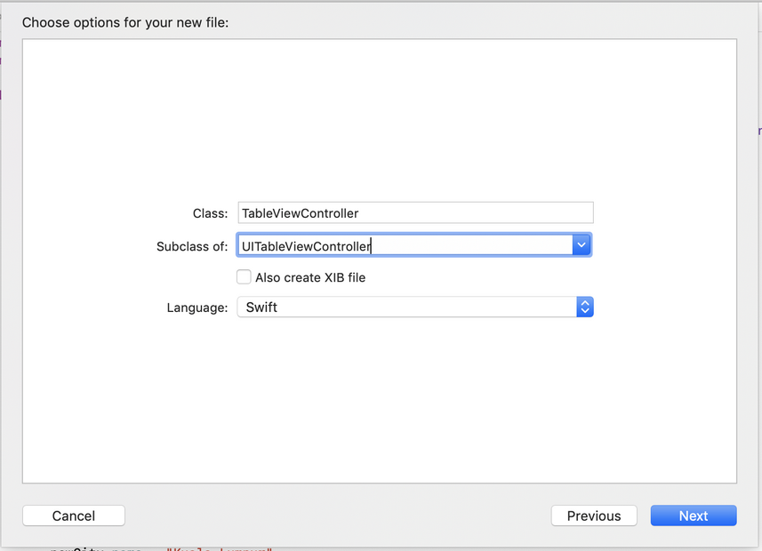
</p>

Create a new file (Cocoa Touch Class). Name it TableViewCell. Make it subclass of UITableViewCell.

Edit TableViewCell.swift. Add these two methods in TableViewCell class.
```swift
    override init(style: UITableViewCell.CellStyle, reuseIdentifier: String?) {
        super.init(style: .subtitle, reuseIdentifier: reuseIdentifier)
    }
    
    required init?(coder aDecoder: NSCoder) {
        super.init(coder: aDecoder)
    }
```

The keypoint is that we use table view cell with subtitle. So there are two lines in a cell.

Edit TableViewController.swift.
```swift
import UIKit
import CoreData
```

Don’t forget to import CoreData.
```swift
class TableViewController: UITableViewController {
    
    private let context = (UIApplication.shared.delegate as! AppDelegate).persistentContainer.viewContext
    private var fetchedRC : NSFetchedResultsController<City>!
```

We create context object which comes from persistent container just like in the previous case. We create NSFetchedResultsController object. You need to give a type for this fetched results controller. In our case, the type is City.
```swift
    override func viewDidLoad() {
        super.viewDidLoad()

        self.tableView.register(TableViewCell.self, forCellReuseIdentifier: "reuseIdentifier")
        
        initData()
        refresh()
    }
```

We indicate that our table view uses our custom TableViewCell and give it identifier “reuseIdentifier”.

Then we call our custom code, initData and refresh methods which will be defined later.
```swift
    private func initData() {
        let request = NSFetchRequest<NSFetchRequestResult>(entityName: "City")
        let deleteRequest = NSBatchDeleteRequest(fetchRequest: request)
        
        do {
            try context.execute(deleteRequest)
        } catch {
            print(error)
        }
        
        let newCity = City(context: context)
        newCity.name = "Kuala Lumpur"
        newCity.area = 6400
        
        let newCity2 = City(context: context)
        newCity2.name = "Ho Chi Minh"
        newCity2.area = 6900
        
        let newCity3 = City(context: context)
        newCity3.name = "Jakarta"
        newCity3.area = 9900
        
        let newCity4 = City(context: context)
        newCity4.name = "Tokyo"
        newCity4.area = 9500
        
        let newCity5 = City(context: context)
        newCity5.name = "Seoul"
        newCity5.area = 2500
        
        do {
            try context.save()
        } catch {
            print(error)
        }
    }
```

The content of this method has been described in the previous section. Basically we wipe out data, create Core Data objects, and persist it to file.
```swift
    private func refresh() {
        let request = City.fetchRequest() as NSFetchRequest<City>
        let nameSort = NSSortDescriptor(keyPath: \City.name, ascending: true)
        request.sortDescriptors = [nameSort]
        
        do {
            fetchedRC = NSFetchedResultsController(fetchRequest: request,
                                                   managedObjectContext: context,
                                                   sectionNameKeyPath: nil, cacheName: nil)
            try fetchedRC.performFetch()
        } catch {
            print(error)
        }
    }
```

We create a fetch request of City entity. To use fetched results controller, we need to use sort descriptor.
```swift
        let request = City.fetchRequest() as NSFetchRequest<City>
        let nameSort = NSSortDescriptor(keyPath: \City.name, ascending: true)
        request.sortDescriptors = [nameSort]
```

Then we create a fetched results controller.
```swift
        do {
            fetchedRC = NSFetchedResultsController(fetchRequest: request,
                                                   managedObjectContext: context,
                                                   sectionNameKeyPath: nil, cacheName: nil)
            try fetchedRC.performFetch()
        } catch {
            print(error)
        }
```

There are 4 parameters in NSFetchedResultsController. The first parameter accepts fetch request instance. The second parameter accepts a context instance. The third parameter is nil and is related if we want to use section in our table view which we don’t. The fourth parameter is nil and is related with cache but we don’t use caching in this simple example.

After creating fetched results controller, we execute performFetch method. But this method does not return results of our City Core Data rows. It only returns true if the method has been executed successfully.

How do you get the results? Later we will see the way to get the results.
```swift
    override func numberOfSections(in tableView: UITableView) -> Int {
        return 1
    }
```

We don’t really use sections in this example.
```swift
    override func tableView(_ tableView: UITableView, numberOfRowsInSection section: Int) -> Int {
        guard let objects = fetchedRC.fetchedObjects else {
            return 0
        }
        return objects.count
    }
```

To get the results / objects, we use fetchedObjects method from fetched requests controller object.
```swift
        guard let objects = fetchedRC.fetchedObjects else {
            return 0
        }
```

Then from the results, we can use count method to get how many results we have.
```swift
        return objects.count
```

Then we add a method to customize the cell.
```swift
    override func tableView(_ tableView: UITableView, cellForRowAt indexPath: IndexPath) -> UITableViewCell {
        let cell = tableView.dequeueReusableCell(withIdentifier: "reuseIdentifier", for: indexPath)
        
        let city = fetchedRC.object(at: indexPath)

        cell.textLabel!.text = city.name
        cell.detailTextLabel!.text = String(city.area)

        return cell
    }
```

To get a specific object, we use object method.
```swift
let city = fetchedRC.object(at: indexPath)
```

Notice object method accepts IndexPath object not a normal integer. This situation happens because fetched results controller can work with section as well.

Once you get the City object, then you can access its properties.
```swift
        cell.textLabel!.text = city.name
        cell.detailTextLabel!.text = String(city.area)
```

Then edit AppDelegate.swift.

Edit application method so our application uses TableViewController as initial controller.
```swift
    func application(_ application: UIApplication, didFinishLaunchingWithOptions launchOptions: [UIApplication.LaunchOptionsKey: Any]?) -> Bool {
        // Override point for customization after application launch.
        self.window = self.window ?? UIWindow()
        self.window!.rootViewController = TableViewController()
        self.window!.makeKeyAndVisible()
        return true
    }
```

Run the application and you will get table view using data from Core Data.
<p align="center">
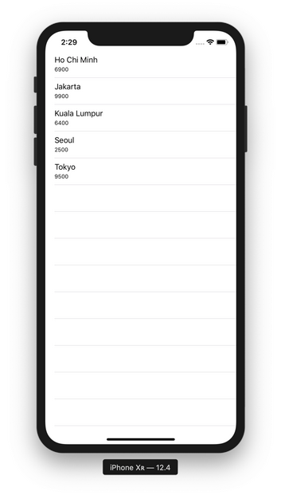
</p>

## Relationships

Create a new single view application.  Name it HelloCoreData3. Don’t forget to check “Use Core Data”.

Click HelloCoreData3.xcdatamodeld and create two entities. The first one is City with attributes: name (type: String) and area (type: Integer 64). The second one is Person with attributes: name (type: String) and age (type: Integer 32).
<p align="center">
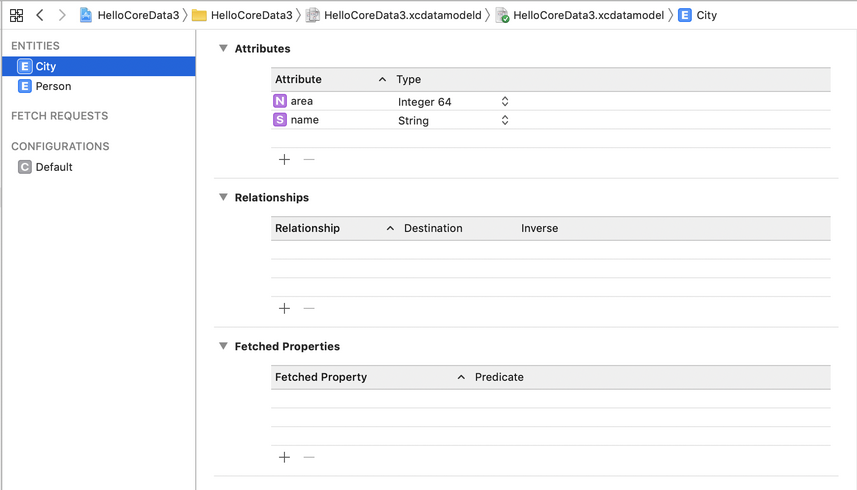
</p>

<p align="center">
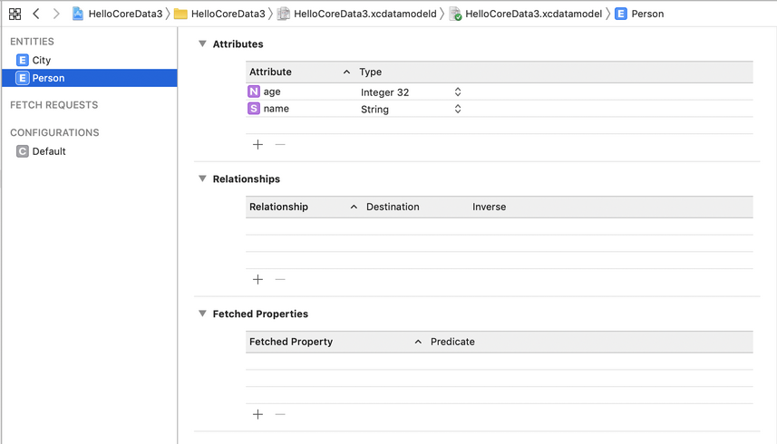
</p>

Then add relationship in City entity.
<p align="center">
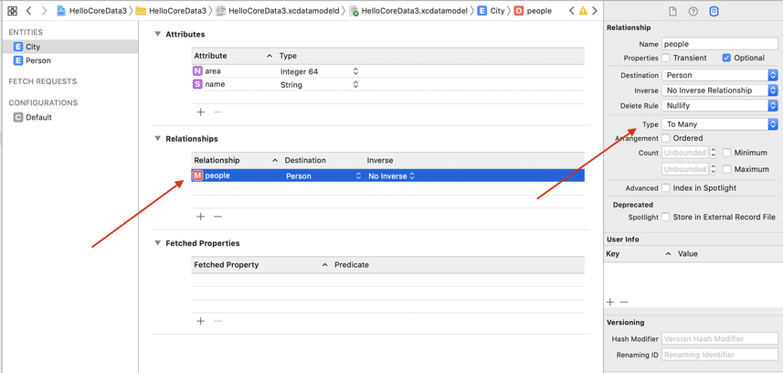
</p>

Don’t forget to change the type of relationship to “To Many”. It means City entity can have many Person entity. The inverse in this case indicates whether a Person entity can have relationship back to City entity.

Edit ViewController.swift.

Import CoreData library.
```swift
import UIKit
import CoreData
```

Create a context object and fetch request object.
```swift
class ViewController: UIViewController {
    
    private let context = (UIApplication.shared.delegate as! AppDelegate).persistentContainer.viewContext
    private let request = NSFetchRequest<NSFetchRequestResult>(entityName: "City")
```

In ViewDidLoad, we initialize data and fetch data using custom methods.
```swift
    override func viewDidLoad() {
        super.viewDidLoad()
        // Do any additional setup after loading the view.
        
        initData()
        retrieveData()
    }
```

In initData method, we create Core Data objects in memory before persisting them.
```swift
    private func initData() {
        let deleteRequest = NSBatchDeleteRequest(fetchRequest: request)
        
        do {
            try context.execute(deleteRequest)
        } catch {
            print(error)
        }
        
        let newCity = City(context: context)
        newCity.name = "Kuala Lumpur"
        newCity.area = 6400
        
        let newPerson = Person(context: context)
        newPerson.name = "John Woo"
        newPerson.age = 46
        
        let newPerson2 = Person(context: context)
        newPerson2.name = "Jack Smith"
        newPerson2.age = 27
        
        newCity.people = [newPerson, newPerson2]
        
        let newCity2 = City(context: context)
        newCity2.name = "Ho Chi Minh"
        newCity2.area = 6900
        
        let newPerson3 = Person(context: context)
        newPerson3.name = " Lisa Cure"
        newPerson3.age = 54
        
        newCity2.people = [newPerson3]
        
        let newCity3 = City(context: context)
        newCity3.name = "Jakarta"
        newCity3.area = 9900
        
        
        do {
            try context.save()
        } catch {
            print(error)
        }
    }
```

Notice how we set the person relationship in City object.
```swift
newCity.people = [newPerson, newPerson2]
```

If the relationship is one to one, we set the person relationship in City object like this:
newCity.people = newPerson

Then in retrieveData method, we can retrieve person relationship from city object.
```swift
    func retrieveData() {
        do {
            let cities = try context.fetch(request) as! [City]
            for c in cities {
                print("\nCity: \(c.name!) \(c.area)")
                for p in c.people! {
                    let person = p as! Person
                    print("Person: \(person.name!) \(person.age)")
                }
            }
        } catch {
            print(error)
        }
    }
```

Notice how we iterate City object’s relationship which is people and we cast the item from the iterator.
```swift
    for p in c.people! {
        let person = p as! Person
        print("Person: \(person.name!) \(person.age)")
    }
```
Run the application and you will get this output.
```
City: Jakarta 9900

City: Kuala Lumpur 6400
Person: Jack Smith 27
Person: John Woo 46

City: Ho Chi Minh 6900
Person:  Lisa Cure 54
```