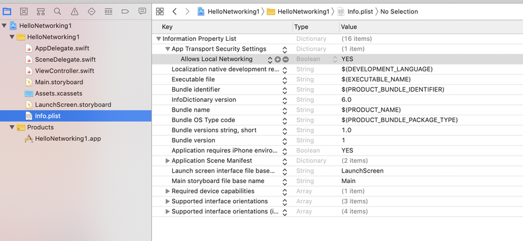
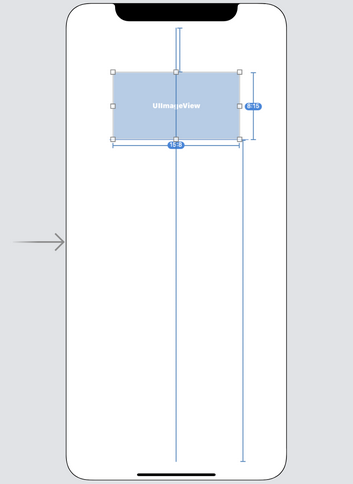
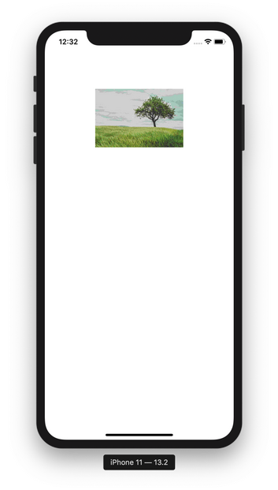
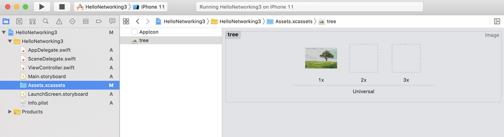
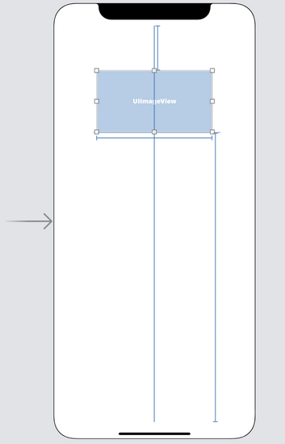
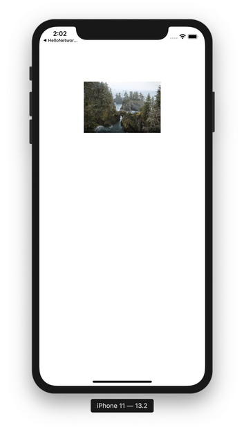
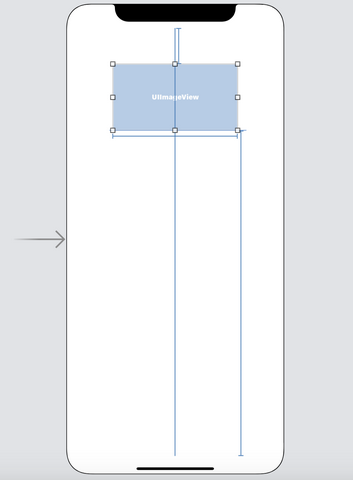
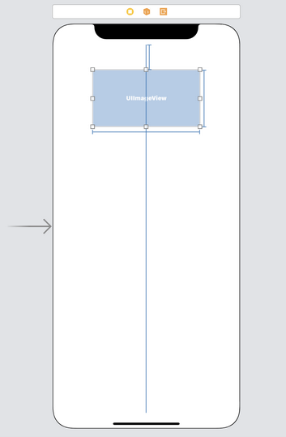
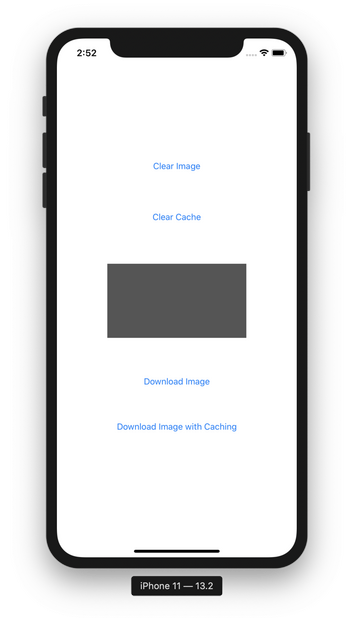

# Networking

We start with simple tasks to download the text string and html page from the server. To achieve that purpose, we use shared URL session.

## App Transport Security Settings

We need to change the configuration of app everytime when we play with localhost instead of server with domain and HTTPS.

Edit info.plist. Add “App Transport Security Settings” key from “Information Property List” key. Then add “Allows Local Networking” key inside “App Transport Security Settings” key. The value of “Allows Local Networking” key is “YES”.
<p align="center">

</p>

## Shared URL Session

To test the networking code, we use local server.

The code of local server is located in Common/Backend/code/HelloBackend1 directory.

Run the flask application.
```
$ source backend-venv/bin/activate
(backend-venv) $ cd Common/Backend/code/HelloBackend1
(backend-venv) $ export FLASK_APP=hello_backend
(backend-venv) $ flask run
```

### dataTask

The first method that we want to use is “dataTask”. We get data in bytes from the URL.

Create a new empty View application. Name it HelloNetworking1.

Edit ViewController.swift. Create a new method and name it getData.
```swift
    func getData() {
        let url = URL(string:"http://localhost:5000")!
        let urlSession = URLSession.shared
        let dataTask = urlSession.dataTask(with: url) { data, response, error in
            if let httpResponse = response as? HTTPURLResponse {
                let string = String(decoding: data!, as: UTF8.self)
                print("=== dataTask ===")
                print(string)
                print(httpResponse.statusCode)
            }
        }
        dataTask.resume()
    }
```

We must create a URL object to represent the url string.
```swift
let url = URL(string:"http://localhost:5000")!
```

URL object has other methods to get the port, to build the query, etc. We will discuss other methods from a URL object later.

Then we can get shared URL session.
```swift
let urlSession = URLSession.shared
```

To download the data from the url, we use “dataTask” method.
```swift
    let dataTask = urlSession.dataTask(with: url) { data, response, error in
        if let httpResponse = response as? HTTPURLResponse {
            let string = String(decoding: data!, as: UTF8.self)
            print("=== dataTask ===")
            print(string)
            print(httpResponse.statusCode)
        }
    }
```

“dataTask” method accepts URL object parameter and the completion callback. The completion callback has 3 parameters: the data that we have got, the response from the url (error, not found or success), the error object.

Calling “dataTask” method itself is not enough. We need to start the process of getting data from the URL by calling “resume” method.
```swift
    dataTask.resume()
```

At first, we cast the response to HTTPURLResponse object. Then we can use “statusCode” attribute from the response object.
```swift
print(httpResponse.statusCode)
```

The data is in bytes so we can decode it with String initializer.
```swift
let string = String(decoding: data!, as: UTF8.self)
```

Don’t forget to call “getData” method in “viewDidLoad” method.
```swift
    override func viewDidLoad() {
        super.viewDidLoad()
        // Do any additional setup after loading the view.
        
        getData()
    }
```

If we run the application, we would get this output.
```
=== dataTask ===
Hello Backend!
200
```

## downloadTask

The second method that we want to use is “downloadTask”. We get data as a file from the URL.

Edit ViewController.swift. Create a new method and name it “download”.
```swift
    func download() {
        let url = URL(string:"http://localhost:5000")!
        let urlSession = URLSession.shared
        let downloadTask = urlSession.downloadTask(with: url) { location, response, error in
            if let url = location, let string = try? String(contentsOf: url), let httpResponse = response as? HTTPURLResponse {
                print("=== downloadTask ===")
                print(string)
                print(httpResponse.statusCode)
            }
        }
        downloadTask.resume()
    }
```

To download the data as a file from the url, we use “downloadTask” method.
```swift
        let downloadTask = urlSession.downloadTask(with: url) { location, response, error in
            if let url = location, let string = try? String(contentsOf: url), let httpResponse = response as? HTTPURLResponse {
                print("=== downloadTask ===")
                print(string)
                print(httpResponse.statusCode)
            }
        }
```

“downloadTask” method accepts URL object parameter and the completion callback. The completion callback has 3 parameters: the location of the file of the data that we have got, the response from the url (error, not found or success), the error object.

Then call the “resume” method.
```swift
    downloadTask.resume()
```

To get the content from the file as a text we use String initializer.
```swift
let string = try? String(contentsOf: url)
```

Don’t forget to call “download” method in “viewDidLoad” method.
```swift
    override func viewDidLoad() {
        super.viewDidLoad()
        // Do any additional setup after loading the view.
        
        download()
        getData()
    }
```

If we run the application, we would get this output.
```
=== downloadTask ===
Hello Backend!
200
```

### mimeType

We can check the mime type of the data we got. Add a new method. Name it “getHtmlData”.
```swift
    func getHtmlData() {
        let url = URL(string:"http://localhost:5000/get_html_file")!
        let urlSession = URLSession.shared
        let dataTask = urlSession.dataTask(with: url) { data, response, error in
            if let httpResponse = response as? HTTPURLResponse, let mimeType = httpResponse.mimeType {
                let string = String(decoding: data!, as: UTF8.self)
                print("=== mimeType ===")
                print(string)
                print(mimeType)
                print(mimeType=="text/html")
                print(httpResponse.statusCode)
            }
        }
        dataTask.resume()
    }
```

To get the mime type of the response, we get the attribute “mimeType” from the HTTP response object.
```swift
let mimeType = httpResponse.mimeType
```

Don’t forget to call “getHtmlData” method in “viewDidLoad” method.
```swift
    override func viewDidLoad() {
        super.viewDidLoad()
        // Do any additional setup after loading the view.
        
        download()
        getData()
        getHtmlData()
    }
```

If we run the application, we would get this output.
```
=== mimeType ===
<!doctype html>
<html>
  <head>
    <title>Hello HTML</title>
  </head>
  <body>
    <p>This is a paragraph</p>
  </body>
</html>
text/html
true
200
```

### statusCode

We can also check whether the URL exists or not by checking the status code of the HTML response.

Create a new method. Name it “getNotFound” method.
```swift
    func getNotFound() {
        let url = URL(string:"http://localhost:5000/get_not_found")!
        let urlSession = URLSession.shared
        let dataTask = urlSession.dataTask(with: url) { data, response, error in
            if let httpResponse = response as? HTTPURLResponse {
                print("=== statusCode ===")
                if httpResponse.statusCode == 404 {
                    print(httpResponse.statusCode)
                }
            }
        }
        dataTask.resume()
    }
```

The not found response code is 404.
```swift
                if httpResponse.statusCode == 404 {
                    print(httpResponse.statusCode)
                }
```

Call “getNotFound” method in “viewDidLoad” method.
```swift
    override func viewDidLoad() {
        super.viewDidLoad()
        // Do any additional setup after loading the view.
        
        download()
        getData()
        getHtmlData()
        getNotFound()
    }
```

If we run the application, we would get this output.
```
=== statusCode ===
404
```

## Downloading Image

We have downloaded data and decode it to string. But sometimes the data cannot be decode back to string because the data is the data from the image.

The code of the local server for this part is located in Common/Backend/code/HelloBackend2 directory. Run the flask app.
```
$ source backend-venv/bin/activate
(backend-venv) $ cd Common/Backend/code/HelloBackend2
(backend-venv) $ export FLASK_APP=hello_image
(backend-venv) $ flask run
```

Create a new empty view project. Name it HelloNetworking2. Don’t forget to set some settings in Info.plist. See the beginning of this document.

Edit Main.storyboard. Add a UIImageView. Give it some constraints.
<p align="center">

</p>

Connect that UIImageView to ViewController.
```swift
    @IBOutlet weak var imageView: UIImageView!
```

Add a method named downloadImage.
```swift
    func downloadImage() {
        let url = URL(string:"http://localhost:5000/image")!
        let urlSession = URLSession.shared
        let dataTask = urlSession.dataTask(with: url) { data, response, error in
            if let httpResponse = response as? HTTPURLResponse, httpResponse.statusCode == 200 {
                let image = UIImage(data: data!)
                DispatchQueue.main.async {
                    self.imageView.image = image
                }
            }
        }
        dataTask.resume()
    }
```

In this method, we reconstruct an image from the data coming from the server.
```swift
let image = UIImage(data: data!)
```

Then to set the image to our image view in the view controller, we need to do it in UI thread.
```swift
    DispatchQueue.main.async {
        self.imageView.image = image
    }
```

Don’t forget to call downloadImage method in viewDidLoad method.
```swift
    downloadImage()
```

If we run the application, we would get this screen.
<p align="center">

</p>

## Uploading Image

To upload an image, we need an image. But first, create an empty view iOS project. Name it HelloNetworking3.

The code of the local server for this part is located in Common/Backend/code/HelloBackend3 directory. Run the flask app.
```
$ source backend-venv/bin/activate
(backend-venv) $ cd Common/Backend/code/HelloBackend3
(backend-venv) $ export FLASK_APP=hello_upload
(backend-venv) $ flask run
```

In Assets.xcassets, add an image. In this example, we use “tree.jpg”.
<p align="center">

</p>

Edit ViewController.swift. Add a new method inside ViewController class. Name it uploadImage.
```swift
    func uploadImage() {
        let image = UIImage(named: "tree")!
        let imageData = image.jpegData(compressionQuality: 1.0)!
        let url = URL(string:"http://localhost:5000/upload_image")!
        let boundaryConstant = "-------------------------abcabcabcabcabcabcabcabcabcabc"
        var request = URLRequest(url: url)
        request.httpMethod = "POST"
        var body = Data()
        body.append("\r\n--\(boundaryConstant)\r\n".data(using: .utf8)!)
        body.append("Content-Disposition: form-data; name=\"file\"; filename=\"tree.jpg\"\r\n".data(using: .utf8)!)
        body.append("Content-Type: image/jpeg\r\n\r\n".data(using: .utf8)!)
        body.append(imageData)
        body.append("\r\n".data(using: .utf8)!)
        body.append("\r\n--\(boundaryConstant)--\r\n".data(using: .utf8)!)
        request.setValue("multipart/form-data; boundary=\(boundaryConstant)", forHTTPHeaderField: "Content-Type")
        request.setValue("\(body.count)", forHTTPHeaderField: "Content-Length")
        let urlSession = URLSession.shared
        let dataTask = urlSession.uploadTask(with: request, from: body) { data, response, error in
            if let httpResponse = response as? HTTPURLResponse, httpResponse.statusCode == 200 {
                let string = String(data: data!, encoding: .utf8)
                print(string!)
            }
        }
        dataTask.resume()
    }
```

Let’s discuss this method lines by lines.

First, we convert the image to bytes data.
```swift
    let image = UIImage(named: "tree")!
    let imageData = image.jpegData(compressionQuality: 1.0)!
```

To create an image object, we can use UIImage with “named” parameter pointing to the name of the image file in Assets.xcassets. Then we can get the bytes data with “jpegData” method.

We create an URL on which where we want to upload the file.
```swift
    let url = URL(string:"http://localhost:5000/upload_image")!
```

Because we use “multipart/form-data” form we need to send the image and its information in the body. Doing so, we need to set the boundary. The boundary can be any sentence we like. It must be unique and there should be a little chance the boundary is represented as part of the content.
```swift
    let boundaryConstant = "-------------------------abcabcabcabcabcabcabcabcabcabc"
```

Then we create a URL request object.
```swift
var request = URLRequest(url: url)
```

This request object is needed because we want to use different method than GET.
```swift
    request.httpMethod = "POST"
```

Then we must create the object representing the image uploaded to the server.
```swift
    var body = Data()
```

We must use “var” not “let” because we want to append the data to this variable.
```swift
    body.append("\r\n--\(boundaryConstant)\r\n".data(using: .utf8)!)
```

To set the boundary in the body of the request, we must prepend double hyphen, “--”, before our boundary string. Because “body” variable is Data, we must decode the string to Data using “data” method.

Then we set the content disposition in this body.
```swift
    body.append("Content-Disposition: form-data; name=\"file\"; filename=\"tree.jpg\"\r\n".data(using: .utf8)!)
```

Content disposition is to set the name of the uploaded file and the name of the field representing the uploaded file. We have to make sure we follow the format, including the double quotes and the new lines in the end of the string.

Then we set the content type in this body to tell the server what kind of data that we embed in the request’s body.
```swift
    body.append("Content-Type: image/jpeg\r\n\r\n".data(using: .utf8)!)
```

Then we set the image’s bytes data itself.
```swift
    body.append(imageData)
    body.append("\r\n".data(using: .utf8)!)
```

The last one is to end it with the boundary string.
```swift
    body.append("\r\n--\(boundaryConstant)--\r\n".data(using: .utf8)!)
```

We still prepend it with double hyphen, “--”, and we also append it with double hyphen, “--”. This is important. The last boundary string must have double hyphen on the left and on the right.

Then we set the length of the body and the boundary in the request’s header.
```swift
    request.setValue("multipart/form-data; boundary=\(boundaryConstant)", forHTTPHeaderField: "Content-Type")
    request.setValue("\(body.count)", forHTTPHeaderField: "Content-Length")
```

To set the request’s header, we use “setValue” method.

Then we can upload the file with “uploadTask” method.
```swift
    let urlSession = URLSession.shared
    let dataTask = urlSession.uploadTask(with: request, from: body) { data, response, error in
        if let httpResponse = response as? HTTPURLResponse, httpResponse.statusCode == 200 {
            let string = String(data: data!, encoding: .utf8)
            print(string!)
        }
    }
```

The “uploadTask” method in this example has two parameters. The first one is for the request object. The second one is for the request’s body.

Then we must start the task of uploading the image.
```swift
    dataTask.resume()
```

Lastly we need to call “uploadImage” method in viewDidLoad method.
```swift
    override func viewDidLoad() {
        super.viewDidLoad()
        // Do any additional setup after loading the view.
        
        uploadImage()
    }
```

If we run the application, we would get this output.
```
Hello Index!
```

Then our “tree.jpg” file will be in “/tmp/uploaded_file” directory.

## Receiving JSON

JSON file format is often used in API endpoint of server. So we usually download JSON file then parse it.

Create an empty view iOS project. Name it HelloNetworking4.

The code of the local server for this part is located in Common/Backend/code/HelloBackend4 directory. Run the flask app.
```
$ source backend-venv/bin/activate
(backend-venv) $ cd Common/Backend/code/HelloBackend4
(backend-venv) $ export FLASK_APP=hello_json
(backend-venv) $ flask run
```

Edit ViewController.swift.

Create two struct declaration outside ViewController class.
```swift
struct CryptocurrencyContainerJson : Decodable {
    let release_date : String
    let cryptocurrencies : [CryptocurrencyJson]
}

struct CryptocurrencyJson : Decodable {
    let name : String
    let price : Int
}
```

This is the structure of our JSON struct when we parse the JSON string.

The method to return JSON string in the server is this one.
```
@app.route("/")
def hello_json():
    return {
        "release_date": "2019-09-09",
        "cryptocurrencies": [
          { "name": "bitcoin", "price": 8000 },
          { "name": "ethereum", "price": 145 },
          { "name": "litecoin", "price": 80 }
        ]
    }
```

Add a new method inside ViewController. Name it getJson.
```swift
    func getJson() {
        let url = URL(string:"http://localhost:5000")!
        let urlSession = URLSession.shared
        let dataTask = urlSession.dataTask(with: url) { data, response, error in
            if let httpResponse = response as? HTTPURLResponse, httpResponse.statusCode == 200 {
                let jsonDecoder = JSONDecoder()
                let cryptocurrencyjson = try! jsonDecoder.decode(CryptocurrencyContainerJson.self, from: data!)
                print(cryptocurrencyjson)
                print(cryptocurrencyjson.cryptocurrencies[0].name)
            }
        }
        dataTask.resume()
    }
```

Once we get the data, we parse the with json decoder with our JSON struct.

Don’t forget to call getJson method inside viewDidLoad method.
```swift
    override func viewDidLoad() {
        super.viewDidLoad()
        // Do any additional setup after loading the view.
        
        getJson()
    }
```

If we run the application, we would get this output.
```
CryptocurrencyContainerJson(release_date: "2019-09-09", cryptocurrencies: [HelloNetworking4.CryptocurrencyJson(name: "bitcoin", price: 8000), HelloNetworking4.CryptocurrencyJson(name: "ethereum", price: 145), HelloNetworking4.CryptocurrencyJson(name: "litecoin", price: 80)])
bitcoin
```

## Sending JSON

We can post a JSON request to the server.

Create an empty view iOS project. Name it HelloNetworking5.

The code of the local server for this part is located in Common/Backend/code/HelloBackend5 directory. Run the flask app.
```
$ source backend-venv/bin/activate
(backend-venv) $ cd Common/Backend/code/HelloBackend5
(backend-venv) $ export FLASK_APP=hello_receive_json
(backend-venv) $ flask run
```

Edit ViewController.swift.

Create a struct declaration outside ViewController class.
```swift
struct CryptocurrencyPriceJson: Codable {
    let name: String
}
```

Add a new method inside ViewController. Name it uploadJson.
```swift
    func uploadJson() {
        let url = URL(string:"http://localhost:5000/")!
        var request = URLRequest(url: url)
        request.httpMethod = "POST"
        request.setValue("application/json", forHTTPHeaderField: "Content-Type")
        let urlSession = URLSession.shared
        let cryptocurrencyPriceJson = CryptocurrencyPriceJson(name: "bitcoin")
        let jsonData = try! JSONEncoder().encode(cryptocurrencyPriceJson)
        let dataTask = urlSession.uploadTask(with: request, from: jsonData) { data, response, error in
            if let httpResponse = response as? HTTPURLResponse, httpResponse.statusCode == 200 {
                let string = String(data: data!, encoding: .utf8)
                print(string!)
            }
        }
        dataTask.resume()
    }
```

We create a JSON type post request.
```swift
    var request = URLRequest(url: url)
    request.httpMethod = "POST"
    request.setValue("application/json", forHTTPHeaderField: "Content-Type")
```

The key point is we set the content type with “setValue” method.

Then we turn the json object to bytes data.
```swift
    let cryptocurrencyPriceJson = CryptocurrencyPriceJson(name: "bitcoin")
    let jsonData = try! JSONEncoder().encode(cryptocurrencyPriceJson)
```

Basically we encode the json object to bytes data with “encode” method of JSONEncoder object.

Don’t forget to call uploadJson method in viewDidLoad method.
```swift
    override func viewDidLoad() {
        super.viewDidLoad()
        // Do any additional setup after loading the view.
        
        uploadJson()
    }
```

If we run the application, we would get this output.
```
10000
```

## Using Delegate

The previous code is using the callback approach. So we call the method to download or upload the data asynchronously. Only when the data is downloaded or uploaded fully, we will get notified. But sometimes we want to be involved in the process of downloading and uploading data. For example: maybe we want to record the progress.

Create an empty view iOS project. Name it HelloNetworking6.

The code of the local server for this part is located in Common/Backend/code/HelloBackend1 directory. Run the flask app.
```
$ source backend-venv/bin/activate
(backend-venv) $ cd Common/Backend/code/HelloBackend1
(backend-venv) $ export FLASK_APP=hello_backend
(backend-venv) $ flask run
```

Edit ViewController.swift.

Our ViewController must implement URLSessionDataDelegate protocol. There is other protocol like URLSessionDownloadDelegate protocol if we prefer to get the data as a file rather than bytes data. But for now we use URLSessionDataDelegate protocol.
```swift
class ViewController: UIViewController, URLSessionDataDelegate {
```

We can not use shared URL session anymore. We must create one from scratch. We create a URL session with custom configuration inside ViewController class.
```swift
    private lazy var urlSession: URLSession = {
        let configuration = URLSessionConfiguration.default
        configuration.waitsForConnectivity = true
        return URLSession(configuration: configuration,
                          delegate: self, delegateQueue: nil)
    }()
```

Inside the code block, we use default URL session configuration and set the “waitsForConnectivity” attribute to be true.  Then we create a URLSession with that configuration and “delegate” set to the ViewController class (remember ViewController implements URLSessionDataDelegate). The “delegateQueue” attribute is set to nil because we use default serial operation queue but we can send a custom OperationQueue for “delegateQueue” attribute.

**Note**

<i>Usually we want the “waitsForConnectivity” attribute to be true. If the value of the attribute is true and there is no network connectivity, when we download the data, we will wait until there is network connectivity.

If the “waitsForConnectivity” attribute is false and there is no network connectivity, we will get exception thrown. One situation when we want to have false value for “waitsForConnectivity” attribute is when we want to buy stocks at that time. We don’t want to buy stocks at another time because the price of the stocks has changed.</i>

We create an empty Data.
```swift
    var downloadedData = Data()
```

Then we call the “dataTask” to download the data.
```swift
    func getData() {
        // Server code is in Common/Backend/code/HelloBackend1
        let url = URL(string:"http://localhost:5000/")!
        let dataTask = urlSession.dataTask(with: url)
        dataTask.resume()
    }
```

There are so many delegate methods we can use. In this example, we use three of them. The first one is when we get new partial data.
```swift
    func urlSession(_ session: URLSession, dataTask: URLSessionDataTask, didReceive data: Data) {
        downloadedData.append(data)
    }
```

In this case we append the partial data to our variable, “downloadedData”.

The second one is when we finish downloading data.
```swift
    func urlSession(_ session: URLSession, task: URLSessionTask, didCompleteWithError error: Error?) {
        if error == nil {
            let string = String(data: downloadedData, encoding: .utf8)!
            print(string)
        }
    }
```

This method is like a callback in previous examples.

The third delegate method is when we receive the header.
```swift
    func urlSession(_ session: URLSession, dataTask: URLSessionDataTask, didReceive response: URLResponse, completionHandler: @escaping (URLSession.ResponseDisposition) -> Void) {
        let httpResponse = response as! HTTPURLResponse
        print(httpResponse.statusCode)
        completionHandler(.allow)
    }
```

In this method, we print the status code. The “completionHandler” method can be used to stop here or continue with the process of downloading data. If we send “.allow” value to “completionHandler” method, it means we continue the process. If we send “.cancel” value to the method, it means we stop the process.

Don’t forget to call “getData” method in viewDidLoad method.

If we run the application, we would get this output.
```
200
Hello Backend!
```

## Handling Redirect

We can intercept the redirect response from the server with delegate methods.

Create an empty view iOS project. Name it HelloNetworking6.

The code of the local server for this part is located in Common/Backend/code/HelloBackend6 directory. Run the flask app.
```
$ source backend-venv/bin/activate
(backend-venv) $ cd Common/Backend/code/HelloBackend6
(backend-venv) $ export FLASK_APP=hello_redirect
(backend-venv) $ flask run
```

Edit ViewController.swift.

This time, our ViewController must implement URLSessionDownloadDelegate protocol.
```swift
class ViewController: UIViewController, URLSessionDownloadDelegate {
```

Create a custom URL session as usual.
```swift
    private lazy var urlSession: URLSession = {
        let configuration = URLSessionConfiguration.default
        configuration.waitsForConnectivity = true
        return URLSession(configuration: configuration,
                          delegate: self, delegateQueue: nil)
    }()
```

Create a “downloadData” method.
```swift
    func downloadData() {
        // Server code is in Common/Backend/code/HelloBackend6
        let url = URL(string:"http://localhost:5000/")!
        let dataTask = urlSession.downloadTask(with: url)
        dataTask.resume()
    }
```

We call “downloadTask” method from “urlSession” variable to prepare the downloading process. To start the downloading process, we call “resume” method.

The first delegate method is when we finish downloading data.
```swift
    func urlSession(_ session: URLSession, downloadTask: URLSessionDownloadTask, didFinishDownloadingTo location: URL) {
        if let string = try? String(contentsOf: location) {
            print(string)
        }
    }
```

In this case we just print the downloaded data after decoding the bytes data.

The second delegate method is when we get the header of the response for the first time.
```swift
    func urlSession(_ session: URLSession, task: URLSessionTask, willPerformHTTPRedirection response: HTTPURLResponse, newRequest request: URLRequest, completionHandler: @escaping (URLRequest?) -> Void) {
        print(response.statusCode)
        completionHandler(request)
    }
```

In this method, we print the status code of the response. Then if we want to continue the process of downloading the data, we must call “completionHandler” with “request” as parameter. If we call “completionHandler” with nil as parameter, we will stop the process of downloading data.

Don’t forget to call “downloadData” method in “viewDidLoad” method.
```swift
    override func viewDidLoad() {
        super.viewDidLoad()
        // Do any additional setup after loading the view.
        
        downloadData()
    }
```

If we run the application, we would get this output.
```
302
Hello Redirect!
```

If we sent nil value to “completionHandler”, we would get this output.
```
302
<!DOCTYPE HTML PUBLIC "-//W3C//DTD HTML 3.2 Final//EN">
<title>Redirecting...</title>
<h1>Redirecting...</h1>
<p>You should be redirected automatically to target URL: <a href="/page2">/page2</a>.  If not click the link.
```

## Getting Progress with Delegate Methods

Handling progress is depended on whether we use URLSessionDataDelegate or URLSessionDownloadDelegate.

Let’s download an image with big size with URLSessionDataDelegate protocol.

Create an empty view project named HelloNetworking8.

Edit Main.storyboard. Add an UIImageView. Then add some constraints.
<p align="center">

</p>

Connect that UIImageView to ViewController.swift. Name the variable imageView.
```swift
    @IBOutlet weak var imageView: UIImageView!
```

Edit ViewController.swift.

Make ViewController implements URLSessionDataDelegate protocol.
```swift
class ViewController: UIViewController, URLSessionDataDelegate {
```

Create URL session object.
```swift
    private lazy var urlSession: URLSession = {
        let configuration = URLSessionConfiguration.default
        configuration.waitsForConnectivity = true
        return URLSession(configuration: configuration,
                          delegate: self, delegateQueue: nil)
    }()
```

Declare “downloadedData” variable to hold the data.
```swift
    var downloadedData = Data()
```

Create a new method named “getImage”.
```swift
    func getImage() {
        // If this image is not available anymore, replace it with any image that is quite big
        let imageUrlString = "https://images.unsplash.com/photo-1573108037329-37aa135a142e?auto=format&fit=crop&w=800"
        let url = URL(string: imageUrlString)!
        let dataTask = urlSession.dataTask(with: url)
        dataTask.resume()
    }
```

We download the image using “dataTask” method.

The first delegate method is when we download the partial data.
```swift
    func urlSession(_ session: URLSession, dataTask: URLSessionDataTask, didReceive data: Data) {
        print(data)
        downloadedData.append(data)
    }
```

The second delegate method is when we finish downloading the data.
```swift
    func urlSession(_ session: URLSession, task: URLSessionTask, didCompleteWithError error: Error?) {
        if error == nil {
            let image = UIImage(data: downloadedData)
            DispatchQueue.main.async {
                self.imageView.image = image
            }
        }
    }
```

We create an image from the bytes data then set it to UIImageView. Remember, we must set the image to UIImageView’s image inside UI thread.

Don’t foget to call “getImage” method inside viewDidLoad method.
```swift
    override func viewDidLoad() {
        super.viewDidLoad()
        // Do any additional setup after loading the view.
        
        downloadData()
    }
```

If we run the application, we would get this output.
```
1027 bytes
6855 bytes
1371 bytes
1371 bytes
...
1371 bytes
1362 bytes
1371 bytes
1371 bytes
1371 bytes
987 bytes
```
We also would get this screen.
<p align="center">

</p>

Let’s download an image with big size with URLSessionDownloadDelegate protocol.

Create an empty view project named HelloNetworking9.

Edit Main.storyboard. Add an UIImageView. Then add some constraints.
<p align="center">

</p>

Connect that UIImageView to ViewController.swift. Name the variable imageView.
```swift
    @IBOutlet weak var imageView: UIImageView!
```

Edit ViewController.swift.

Make ViewController implements URLSessionDownloadDelegate protocol.
```swift
class ViewController: UIViewController, URLSessionDownloadDelegate {
```

Create URL session object.
```swift
    private lazy var urlSession: URLSession = {
        let configuration = URLSessionConfiguration.default
        configuration.waitsForConnectivity = true
        return URLSession(configuration: configuration,
                          delegate: self, delegateQueue: nil)
    }()
```

Create a new method, named “downloadData”.
```swift
    func downloadData() {
        // If this image is not available anymore, replace it with any image that is quite big
        let imageUrlString = "https://images.unsplash.com/photo-1573108037329-37aa135a142e?auto=format&fit=crop&w=800"
        let url = URL(string: imageUrlString)!
        let dataTask = urlSession.downloadTask(with: url)
        dataTask.resume()
    }
```

In this method, we download the data using “downloadTask” method.

The first delegate method is when we finish downloading the data.
```swift
    func urlSession(_ session: URLSession, downloadTask: URLSessionDownloadTask, didFinishDownloadingTo location: URL) {
        let data = try! Data(contentsOf: location)
        let image = UIImage(data: data)
        DispatchQueue.main.async {
            self.imageView.image = image
        }
    }
```

We get the bytes data from the downloaded file. Then we construct an image object. Finally, we set the image to UIImageView’s image in UI thread.

The second delegate method is when we get the length of the partial data we have downloaded.
```swift
    func urlSession(_ session: URLSession, downloadTask: URLSessionDownloadTask, didWriteData bytesWritten: Int64, totalBytesWritten: Int64, totalBytesExpectedToWrite: Int64) {
        print("Total bytes downloaded: \(totalBytesWritten)")
        print("Total bytes downloaded (percentage): \((Float(totalBytesWritten) / Float(totalBytesExpectedToWrite)) * 100)%")
    }
```

“ bytesWritten” is the length of partial data that we get at the particular moment. “totalBytesWritten” is the length of all of the partial data that we have got until the particular moment. “totalBytesExpectedToWrite” is the length of all the data that we are supposed to get.

If we run the application, we would get this output.
```
Total bytes downloaded: 1030
Total bytes downloaded (percentage): 0.86180204
Total bytes downloaded: 13369
Total bytes downloaded (percentage): 11.185856
Total bytes downloaded: 14740
Total bytes downloaded (percentage): 12.3329735
...
Total bytes downloaded: 53101
Total bytes downloaded (percentage): 44.429665
Total bytes downloaded: 55843
Total bytes downloaded (percentage): 46.723896
Total bytes downloaded: 57214
Total bytes downloaded (percentage): 47.871014
Total bytes downloaded: 58585
Total bytes downloaded (percentage): 49.01813
Total bytes downloaded: 61327
Total bytes downloaded (percentage): 51.312363
Total bytes downloaded: 62698
Total bytes downloaded (percentage): 52.459484
Total bytes downloaded: 65440
Total bytes downloaded (percentage): 54.753716
Total bytes downloaded: 119517
Total bytes downloaded (percentage): 100.0
```

We also would get this screen.
<p align="center">

</p>

## Background Download

In the previous examples, if we stopped the downloading process (the application was put in the background) before the download process was finished, we would get error if we resumed the application later.

We would this kind of error:
```
2019-11-17 11:25:41.932226+0700 HelloNetworking9[734:208194] [] nw_read_request_report [C1] Receive failed with error "Software caused connection abort"
2019-11-17 11:25:41.934125+0700 HelloNetworking9[734:208194] [] nw_read_request_report [C1] Receive failed with error "Software caused connection abort"
2019-11-17 11:25:41.936383+0700 HelloNetworking9[734:208194] Task <14058076-A864-4477-B486-732483B14F6B>.<1> HTTP load failed, 752/17339514 bytes (error code: -1005 [1:53])
```

If we want the download process keeps running in the background, we need to use background download process.

Create a new empty view application. Name it HelloNetworking10.

Edit Main.storyboard. Add a UIImageView and put some constraints.
<p align="center">

</p>

Connect this UIImageView to ViewController and name it imageView.
```swift
    @IBOutlet weak var imageView: UIImageView!
```

Edit ViewController.swift.

Make ViewController class implements URLSessionDownloadDelegate.
```swift
class ViewController: UIViewController, URLSessionDownloadDelegate {
```

Create a URLSession object.
```swift
    private lazy var urlSession: URLSession = {
        let config = URLSessionConfiguration.background(withIdentifier: "BackgroundSession1")
        config.isDiscretionary = true
        config.sessionSendsLaunchEvents = true
        return URLSession(configuration: config, delegate: self, delegateQueue: nil)
    }()
```

We create a background URLSessionConfiguration and we must set the identifier. This identifier will be useful so we and the system can differentiate them later.
```swift
let config = URLSessionConfiguration.background(withIdentifier: "BackgroundSession1")
```

Then we must set the true value to “isDiscretionary” attribute.
```swift
config.isDiscretionary = true
```

This true value lets the system thinks when it is best to download the large file (whether we are connected to Wi-Fi or not).

Then we must set the true value to “sessionSendsLaunchEvents” attribute.
```swift
config.sessionSendsLaunchEvents = true
```

This true value lets the system launch the application in the background when the download process is finished or there is authentication issue.

Then we create a URLSession object with this configuration.
```swift
return URLSession(configuration: config, delegate: self, delegateQueue: nil)
```

Then we create a method to execute the background download process. Name the method “downloadData” method.
```swift
    func downloadData() {
        // If this image is not available anymore, replace it with any image that is quite big
        let imageUrlString = "https://images.unsplash.com/photo-1573108037329-37aa135a142e"
        let url = URL(string: imageUrlString)!
        let downloadTask = urlSession.downloadTask(with: url)
        downloadTask.earliestBeginDate = Date().addingTimeInterval(1)
        downloadTask.resume()
    }
```

We can set the download task to begin after a specified time.
```swift
downloadTask.earliestBeginDate = Date().addingTimeInterval(1)
```

Don’t forget to call “downloadData” method in “viewDidLoad” method.
```swift
    override func viewDidLoad() {
        super.viewDidLoad()
        // Do any additional setup after loading the view.
        
        downloadData()
    }
```

As usual we can create two delegate methods.
```swift
    func urlSession(_ session: URLSession, downloadTask: URLSessionDownloadTask, didWriteData bytesWritten: Int64, totalBytesWritten: Int64, totalBytesExpectedToWrite: Int64) {
        print("Total bytes downloaded: \(totalBytesWritten)")
        print("Total bytes downloaded (percentage): \((Float(totalBytesWritten) / Float(totalBytesExpectedToWrite)) * 100)%")
    }
    
    func urlSession(_ session: URLSession, downloadTask: URLSessionDownloadTask, didFinishDownloadingTo location: URL) {
        let data = try! Data(contentsOf: location)
        let image = UIImage(data: data)
        DispatchQueue.main.async {
            self.imageView.image = image
        }
    }
```

One is for the progress of downloading data. The other is to create an image from the downloaded data and set it to UIImageView.

There is another delegate method.
```swift
    func urlSessionDidFinishEvents(forBackgroundURLSession session: URLSession) {
        print("urlSessionDidFinishEvents")
        DispatchQueue.main.async {
            if let appDelegate = UIApplication.shared.delegate as? AppDelegate,
                let backgroundCompletionHandler = appDelegate.backgroundCompletionHandler {
                backgroundCompletionHandler()
            }
        }
    }
```

This delegate method is called when the events in downloading process are done.

In this case, we execute the method named “backgroundCompletionHandler”. This is a custom method which is defined in AppDelegate class.

Edit AppDelegate.swift.

Create a property inside AppDelegate class.
```swift
var backgroundCompletionHandler: (() -> Void)? = nil
```

Create a delegate method.
```swift
    func application(_ application: UIApplication, handleEventsForBackgroundURLSession identifier: String, completionHandler: @escaping () -> Void) {
        print(identifier)
        self.backgroundCompletionHandler = completionHandler
    }
```

If our background download process is not finished when we put the application in the background, the system will take over the download process. Then when the download process is finished, the system will call this method so we can do something with the downloaded data in the background.

The “identifier” variable is the identifier we set when we create URL session configuration. We can differentiate the background download process with this “identifier” variable.

We set completionHandler’s value to “backgroundCompletionHandler” property. Remember in urlSessionDidFinishEvents method, we execute “backgroundCompletionHandler” method? This method actually updates the snapshot of the application.

What is snapshot? It’s an image of our application when we view the list of running application.
<p align="center">

</p>

As we can see because we call the completionHandler, the snapshot of our application is updated (we have an image of tree). If we don’t do that, the snapshot of our application will not be updated. The snapshot of our application will be blank. Only when we bring the application forward, then we can see the image.

Run the application. You must run it with device. You can not test the background download process properly with simulator. After running the application, we could see the log in output.
```
Total bytes downloaded: 1362
Total bytes downloaded (percentage): 0.0041096844%
Total bytes downloaded: 17805
Total bytes downloaded (percentage): 0.053724617%
Total bytes downloaded: 21918
Total bytes downloaded (percentage): 0.06613514%
Total bytes downloaded: 24660
Total bytes downloaded (percentage): 0.07440882%
Total bytes downloaded: 27402
Total bytes downloaded (percentage): 0.082682505%
Total bytes downloaded: 31515
Total bytes downloaded (percentage): 0.09509303%
Total bytes downloaded: 32877
Total bytes downloaded (percentage): 0.09920271%
Total bytes downloaded: 34248
Total bytes downloaded (percentage): 0.10333955%
Total bytes downloaded: 36990
Total bytes downloaded (percentage): 0.11161324%
```

Then put the application into the background by pressing Home button.

After a while we would get this output.
```
BackgroundSession1
urlSessionDidFinishEvents
```

We can see the list of running apps, and we can view that our snapshot has been updated.

## Uploading Form

We can upload form data.

Create a new empty view application. Name it HelloNetworking11.

Create uploadForm method.
```swift
    func uploadForm() {
        let url = URL(string:"http://localhost:5000/")!
        var request = URLRequest(url: url)
        request.httpMethod = "POST"
        let urlSession = URLSession.shared
        var body = Data()
        body.append("name=john woo&age=23".data(using: .utf8)!)
        let dataTask = urlSession.uploadTask(with: request, from: body) { data, response, error in
            if let httpResponse = response as? HTTPURLResponse, httpResponse.statusCode == 200 {
                let string = String(data: data!, encoding: .utf8)
                print(string!)
            }
        }
        dataTask.resume()
    }
```

We create a POST request object.
```swift
        var request = URLRequest(url: url)
        request.httpMethod = "POST"
```

To post data with “name” field and “age” field, we use normal string in bytes mode. We set the value with “=” character and combine both fields with “&” character.
```swift
        var body = Data()
        body.append("name=john woo&age=23".data(using: .utf8)!)
```

Then we can send this data as request body.
```swift
        let dataTask = urlSession.uploadTask(with: request, from: body) { data, response, error in
```

Don’t forget to call uploadForm method in viewDidLoad method.
```swift
    override func viewDidLoad() {
        super.viewDidLoad()
        // Do any additional setup after loading the view.
        
        uploadForm()
    }
```

If we run this application, we would get this output.
```
JOHN WOO is 46 years old
```

## HTTP Basic Authentication

We can login through HTTP Basic Authentication.

Create a new empty view project. Name it HelloNetworking12.

Edit ViewController.swift.

Make sure ViewController implements URLSessionDataDelegate.

Create URLSession object and Data object.
```swift
     private lazy var urlSession: URLSession = {
        let configuration = URLSessionConfiguration.default
        configuration.waitsForConnectivity = true
        return URLSession(configuration: configuration,
                          delegate: self, delegateQueue: nil)
    }()
    
    var downloadedData = Data()
```

Create two overriden methods for downloading data and printing data.
```swift
    func urlSession(_ session: URLSession, dataTask: URLSessionDataTask, didReceive data: Data) {
        downloadedData.append(data)
    }
    
    func urlSession(_ session: URLSession, task: URLSessionTask, didCompleteWithError error: Error?) {
        if error == nil {
            let httpResponse = task.response as! HTTPURLResponse
            print(httpResponse.statusCode)
            let string = String(data: downloadedData, encoding: .utf8)!
            print(string)
        }
    }
```

Create a method to call “dataTask” method. Name it “loginWebsite” method.
```swift
    func loginWebsite() {
        // Server code is in Common/Backend/code/HelloBackend8
        let url = URL(string:"http://localhost:5000/")!
        let dataTask = urlSession.dataTask(with: url)
        dataTask.resume()
    }
```

Don’t forget to call “loginWebsite” method inside “viewDidLoad” method.
```swift
    override func viewDidLoad() {
        super.viewDidLoad()
        // Do any additional setup after loading the view.
        
        loginWebsite()
    }
```

If we ran application at this point, we would get authentication error.
```
401
Unauthorized Access
```

The response code is 401.

To pass the authentication, we need to supply the correct username and password.

We need to override a special method to login passing HTTP Basic Authentication.
```swift
    func urlSession(_ session: URLSession, task: URLSessionTask, didReceive challenge: URLAuthenticationChallenge, completionHandler: @escaping (URLSession.AuthChallengeDisposition, URLCredential?) -> Void) {
        let authMethod = challenge.protectionSpace.authenticationMethod
        guard authMethod == NSURLAuthenticationMethodHTTPBasic else {
            completionHandler(.performDefaultHandling, nil)
            return
        }

        let credential = URLCredential(user: "john", password: "hello", persistence: .forSession)
        completionHandler(.useCredential, credential)
    }
```

First, we check whether the authentication is HTTP Basic Authentication.
```swift
        let authMethod = challenge.protectionSpace.authenticationMethod
        guard authMethod == NSURLAuthenticationMethodHTTPBasic else {
            completionHandler(.performDefaultHandling, nil)
            return
        }
```

If it is indeed HTTP Basic Authentication, we need to supply the credential and use it.
```swift
        let credential = URLCredential(user: "john", password: "hello", persistence: .forSession)
        completionHandler(.useCredential, credential)
```

If we ran the application again, we would get this output.
```
200
Hello, john!
```

## Login via JSON Web Token (JWT)

Let’s create an empty view project. Name it HelloNetworking13.

The server code is in Common/Backend/code/HelloBackend9.

Edit ViewController.swift.

Create two structs for encoding and decoding jsong data.
```swift
struct UserAuth: Codable {
    let username: String
    let password: String
}

struct AccessToken: Codable {
    let access_token: String
}
```

The UserAuth struct is used to send the username and the password to get the token.

The AccessToken struct is used to send access token to get the protected data.

Create a method named getData to get the protected data with token.
```swift
    func getData(_ accessToken: String) {
        let url = URL(string:"http://localhost:5000/secret")!
        var request = URLRequest(url: url)
        request.setValue("JWT \(accessToken)", forHTTPHeaderField: "Authorization")
        
        let urlSession = URLSession.shared
        let secretTask = urlSession.dataTask(with: request) { data, response, error in
            if let httpResponse = response as? HTTPURLResponse, httpResponse.statusCode == 200 {
                let string = String(decoding: data!, as: UTF8.self)
                print(string)
            }
        }
        secretTask.resume()
    }
```

To authenticate our request with token, we use header field of the request.
```swift
        request.setValue("JWT \(accessToken)", forHTTPHeaderField: "Authorization")
```

After getting the protected data, we decode the json data.
```swift
                let string = String(decoding: data!, as: UTF8.self)
                print(string)
```

Then we need to create a method to get the token.
```swift
    func login() {
        let url = URL(string:"http://localhost:5000/auth")!
        var request = URLRequest(url: url)
        request.httpMethod = "POST"
        request.setValue("application/json", forHTTPHeaderField: "Content-Type")
        
        let userAuth = UserAuth(username: "john", password: "password")
        let uploadData = try! JSONEncoder().encode(userAuth)
        
        let urlSession = URLSession.shared
        let loginTask = urlSession.uploadTask(with: request, from: uploadData) { data, response, error in
            if let httpResponse = response as? HTTPURLResponse, httpResponse.statusCode == 200 {
                let accessToken = try! JSONDecoder().decode(AccessToken.self, from: data!)
                // It's better to encrypt the token rather than put it in memory like this
                // We put it in memory just for the sake of the tutorial
                self.getData(accessToken.access_token)
            }
        }
        loginTask.resume()
    }
```

First, we must set the type of the request to be POST and the content type of the request is JSON type.
```swift
        let url = URL(string:"http://localhost:5000/auth")!
        var request = URLRequest(url: url)
        request.httpMethod = "POST"
        request.setValue("application/json", forHTTPHeaderField: "Content-Type")
```

We create a json data of our username and password.
```swift
        let userAuth = UserAuth(username: "john", password: "password")
        let uploadData = try! JSONEncoder().encode(userAuth)
```

Then we send our json with uploadTask method.
```swift
        let loginTask = urlSession.uploadTask(with: request, from: uploadData) { data, response, error in
```

When we get the token, we immediately execute getData method in the callback.
```swift
            if let httpResponse = response as? HTTPURLResponse, httpResponse.statusCode == 200 {
                let accessToken = try! JSONDecoder().decode(AccessToken.self, from: data!)
                // It's better to encrypt the token rather than put it in memory like this
                // We put it in memory just for the sake of the tutorial
                self.getData(accessToken.access_token)
            }
```

Don’t forget to run “login” method in viewDidLoad method.
```swift
    override func viewDidLoad() {
        super.viewDidLoad()
        // Do any additional setup after loading the view.
        
        // Code for backend is in Common/Backend/code/HelloBackend9
        login()
    }
```

If we ran the application, we would get this output.
```swift
User(id='1')
```

## Caching

We can cache the downloaded data.

Create a single view application and name it HelloNetworking14.

Edit Main.storyboard.

Add one image view on the center. Give it grey background.

Then link it to ViewController and name it imageView.
```swift
    @IBOutlet weak var imageView: UIImageView!
```

Add a button on top of the image view. Give it this label: “Clear Cache”.

Then create a callback in ViewController and name the callback buttonOnClickedClearCache.
```swift
    @IBAction func buttonOnClickedClearCache(_ sender: UIButton) {
        URLCache.shared.removeAllCachedResponses()
    }
```

In this callback, we remove all cached responses.

Add a button on top of the previous button. Give it this label: “Clear Image”.

Then create a callback in ViewController and name the callback buttonOnClickedClearImage.
```swift
    @IBAction func buttonOnClickedClearImage(_ sender: UIButton) {
        self.imageView.image = nil
    }
```

In this callback, we remove the image from the image view.

Add a button on the bottom of the image. Give it this label: “Download Image”.

Then create a callback in ViewController and name the callback buttonOnClicked.
```swift
    @IBAction func buttonOnClicked(_ sender: UIButton) {
        getImage()
    }
```

Later we will define getImage method.

Add a button on the bottom of the previous image. Give it this label: “Download Image with Caching”.
```swift
    @IBAction func buttonOnClickedCaching(_ sender: Any) {
        getImageWithCache()
    }
```

Later we wil define getImageWithCache method.

Edit ViewController.swift.

Define the URL of the image we want to download inside ViewController class.
```swift
    // If this image is not available anymore, replace it with any image that is quite big
    let imageUrlString = "https://images.unsplash.com/photo-1573108037329-37aa135a142e?auto=format&fit=crop&w=800"
```

Create a data variable to hold the downloaded data inside ViewController class.
```swift
    var downloadedData = Data()
```

Create a URL session inside ViewController class.
```swift
    private lazy var urlSession: URLSession = {
        let configuration = URLSessionConfiguration.default
        configuration.waitsForConnectivity = true
        return URLSession(configuration: configuration,
                          delegate: self, delegateQueue: nil)
    }()
```

Override a method to append the partial data to the overall downloaded data.
```swift
    func urlSession(_ session: URLSession, dataTask: URLSessionDataTask, didReceive data: Data) {
        print(data)
        downloadedData.append(data)
    }
```

Override a method when we have finished downloading the data.
```swift
    func urlSession(_ session: URLSession, task: URLSessionTask, didCompleteWithError error: Error?) {
        if error == nil {
            let cacheControl = (task.response as! HTTPURLResponse).allHeaderFields["Cache-Control"]!
            print(cacheControl)
            
            let image = UIImage(data: downloadedData)
            DispatchQueue.main.async {
                self.imageView.image = image
            }
            
            downloadedData.removeAll()
        }
    }
```

We can get the header fields from the response. There are cache related header fields on which we can learn about caching policy from the server. To get the header fields and their value, we can use allHeaderFields property.
```swift
    let cacheControl = (task.response as! HTTPURLResponse).allHeaderFields["Cache-Control"]!
```

We can construct an image and set it to the image view.
```swift
    let image = UIImage(data: downloadedData)
    DispatchQueue.main.async {
        self.imageView.image = image
    }
```

Define getImage method.
```swift
    func getImage() {
        self.imageView.image = nil
        let url = URL(string: imageUrlString)!
        var request = URLRequest(url: url)
        request.cachePolicy = .reloadIgnoringLocalCacheData
        let dataTask = urlSession.dataTask(with: request)
        dataTask.resume()
    }
```

To define the caching policy of the request, we can set the cachePolicy property of the request object.
```swift
    var request = URLRequest(url: url)
    request.cachePolicy = .reloadIgnoringLocalCacheData
```

This cache policy means we ignore the cache data. We always download the data from the server.

Define getImageWithCache method.
```swift
    func getImageWithCache() {
        self.imageView.image = nil
        let url = URL(string: imageUrlString)!
        var request = URLRequest(url: url)
        request.cachePolicy = .returnCacheDataDontLoad
        let dataTask = urlSession.dataTask(with: request)
        dataTask.resume()
    }
```

This cache policy means we always use the cache data. If there is no cache data, we still would not download the image from the server.

If we ran the application, we would get this screen.
<p align="center">

</p>

Click “Download Image” button, and we would get this output.
```
1026 bytes
9597 bytes
1371 bytes
...
1371 bytes
5475 bytes
988 bytes
public, max-age=315360000
```

The image would appear.

Click “Clear Image” button to remove the image from the image view. Then click “Download Image with Cache” button, and we would get this output.
```
119517 bytes
public, max-age=315360000
```

Click “Clear Cache” button and click “Clear Image” button. Then click “Download Image with Cache” button,  and we would get this output.
```
HelloNetworking14[18554:1663444] Task <2D3EE914-6EE8-4993-97D1-261DC8A389EB>.<5> finished with error [-1008] Error Domain=NSURLErrorDomain Code=-1008 "resource unavailable" UserInfo={NSLocalizedDescription=resource unavailable, NSErrorFailingURLStringKey=https://images.unsplash.com/photo-1573108037329-37aa135a142e?auto=format&fit=crop&w=800, NSErrorFailingURLKey=https://images.unsplash.com/photo-1573108037329-37aa135a142e?auto=format&fit=crop&w=800, _NSURLErrorRelatedURLSessionTaskErrorKey=(
    "LocalDataTask <2D3EE914-6EE8-4993-97D1-261DC8A389EB>.<5>"
), _NSURLErrorFailingURLSessionTaskErrorKey=LocalDataTask <2D3EE914-6EE8-4993-97D1-261DC8A389EB>.<5>, NSUnderlyingError=0x60000051c270 {Error Domain=kCFErrorDomainCFNetwork Code=-1008 "(null)"}}
```