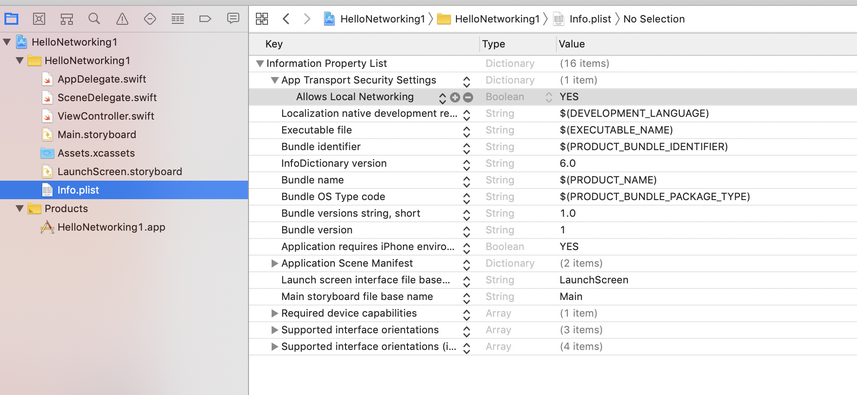
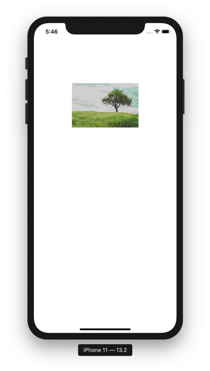
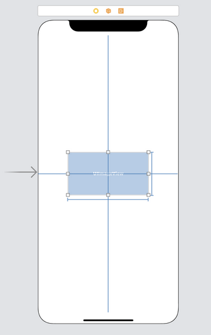
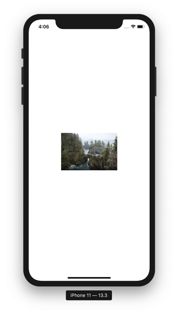

# Alamofire

Alamofire is a library for networking. It is built based on URLSession, the native networking API. The API of Alamofire is nicer and simpler.

We will use Alamofire version 5 not 4.

To install Alamofire version 5 with Swift Package Manager, we use Version exact 5.0.0-rc.3.

## App Transport Security Settings

We need to change the configuration of app everytime when we play with localhost instead of server with domain and HTTPS.

Edit info.plist. Add “App Transport Security Settings” key from “Information Property List” key. Then add “Allows Local Networking” key inside “App Transport Security Settings” key. The value of “Allows Local Networking” key is “YES”.
<p align="center">

</p>

## AF Namespace

The networking API methods are put inside AF namespace.

Create a new empty view application. Name it HelloAlamofire1.

The server code is in Common/Backend/code/HelloBackend1.

Edit ViewController.swift.

Add import line.
```swift
import Alamofire
```

Create a new method named “getData”.
```swift
    func getData() {
        AF.request("http://localhost:5000")
            .validate(statusCode: 200..<300)
            .responseString { response in
                switch response.result {
                case .success:
                    if let string = response.value {
                        print("=== request ===")
                        print(response.response!.statusCode)
                        print(string)
                    }
                case let .failure(error):
                    print(error)
                }
        }
    }
```

To connect to the server, we can use AF.request method.
```swift
    AF.request("http://localhost:5000")
```

We can chain it with “validate” method to check the property of the response.
```swift
        .validate(statusCode: 200..<300)
```

If we want to get the response as a string, we can use “responseString” method.
```swift
    .responseString { response in
        switch response.result {
        case .success:
            if let string = response.value {
                print("=== request ===")
                print(response.response!.statusCode)
                print(string)
            }
        case let .failure(error):
            print(error)
        }
```

“responseString” method receives a callback which accepts a response parameter. We can check whether the response is success or failure from the “result” property. To get the string response, we use “value” property. If we want to get the status code, we can get it from “response” property.

Create a new method named “download”.
```swift
    func download() {
        AF.download("http://localhost:5000").responseData { response in
            if let data = response.value, let string = String(data: data, encoding: .utf8) {
                print("=== download ===")
                print(string)
            }
        }
    }
```

Here, we use “AF.download” method to download data. The difference between “AF.download” and “AF.request” method is the “AF.download” put data into the file while “AF.request” put data into the memory. If the data is too big for the memory, it is better to use “AF.download”.

If we want to get the data as binary bytes not as a string, we can use “responseData” method instead of “responseString” method.

Create a new method named “getHtmlData”.
```swift
    func getHtmlData() {
        AF.request("http://localhost:5000/get_html_file")
            .responseString { response in
                if let string = response.value {
                    print("=== mimeType ===")
                    print(response.response!.mimeType!)
                    print(string)
                }
        }
    }
```

We can get mime type with “mimeType” property.
```swift
    print(response.response!.mimeType!)
```

Create a new method named “getNotFound”.
```swift
    func getNotFound() {
        AF.request("http://localhost:5000/get_not_found").response { response in
            print("=== not found ===")
            switch response.result {
            case .success:
                print(response.response!.statusCode)
            case let .failure(error):
                print(error)
            }
        }
    }
```

The not found response is considered success. But we can check the status code with “statusCode” property.

Call these 4 methods in viewDidLoad method.
```swift
    override func viewDidLoad() {
        super.viewDidLoad()
        // Do any additional setup after loading the view.
        
        download()
        getData()
        getHtmlData()
        getNotFound()
    }
```

If we ran the application, we would get this output.
```
=== download ===
Hello Backend!
=== request ===
200
Hello Backend!
=== mimeType ===
text/html
<!doctype html>
<html>
  <head>
    <title>Hello HTML</title>
  </head>
  <body>
    <p>This is a paragraph</p>
  </body>
</html>
=== not found ===
404
```

## Downloading Image

We can download image with “AF.request” or “AF.download” methods.

Create a new application, named HelloAlamofire2. The server code is in Common/Backend/code/HelloBackend2.

Add an UIImageView in the Storyboard and link it to ViewController.
```swift
    @IBOutlet weak var imageView: UIImageView!
```

Import Alamofire library.
```swift
import Alamofire
```

Create a method named “downloadImage”.
```swift
    func downloadImage() {
        // Server code is in Common/Backend/code/HelloBackend2
        AF.download("http://localhost:5000/image").responseData { response in
            if let data = response.value, let image = UIImage(data: data) {
                DispatchQueue.main.async {
                    self.imageView.image = image
                }
            }
        }
    }
```

We need to use “responseData” method because image is binary data. Then in the callback, we can use “value” property from the response object. Then we can construct a UIImage object before setting it to the “image” property of the image view object on the screen.

If we ran the application, we would get this screen.
<p align="center">

</p>

## Uploading Image

Uploading image is easier with Alamofire than URLSession only.

Create a new empty view application. Name it HelloAlamofire3. The server code is in Common/Backend/code/HelloAlamofire3.

Edit ViewController.swift.

Add a JPG image to Assets.xcassets. Name it tree.

Add importing library statement.
```swift
import Alamofire
```

Create a method to upload an image named “uploadImage”.
```swift
    func uploadImage() {
        // Server code is in Common/Backend/code/HelloBackend3
        let image = UIImage(named: "tree")!
        let imageData = image.jpegData(compressionQuality: 1.0)!
        AF.upload(
            multipartFormData: { multipartFormData in
                multipartFormData.append(imageData, withName: "file", fileName: "tree.jpg", mimeType: "image/jpeg")
                    
            },
            to: "http://localhost:5000/upload_image"
        ).responseString { response in
            if let string = response.value {
                print(string)
            }
        }
    }
```

We get the reference to the image with UIImage object. Then we get the binary data of this image with “jpegData” method.

To upload the image (or a file in general), we can use AF.upload method. We fill 2 parameters to this method. The first method is multipartFormData which accepts a block. Inside this block, we append to the form data of our image (the binary data, the field name, and the mime type). The second parameter is the destination (the URL endpoint of the server accepting the image).

Then we can get the response from the server as usual.  In this example, we use “responseString” method.

Don’t forget to call uploadImage method inside viewDidLoad method.
```swift
    override func viewDidLoad() {
        super.viewDidLoad()
        // Do any additional setup after loading the view.
        
        uploadImage()
    }
```

If we ran the application, we would get this output.
```
Hello Index!
```

We can check the file should exist in “/tmp/uploaded_file/tree.jpg” in the server.

## Downloading JSON

To process JSON string, we can use “responseJSON” method.

Create a new empty view application. Name it HelloAlamofire4. The code for the backend is in Common/Backend/code/HelloBackend4.

Edit ViewController.swift.

Add an import statement.
```swift
import Alamofire
```

Create a method to download and process JSON string. Name it “getJson”.
```swift
    func getJson() {
        AF.request("http://localhost:5000").responseJSON { response in
            if let cryptocurrencyDict = response.value as? NSDictionary {
                print(cryptocurrencyDict["release_date"]!)
                let cryptocurrencies = cryptocurrencyDict["cryptocurrencies"]! as! NSArray
                let cryptocurrency = cryptocurrencies[0] as! NSDictionary
                print(cryptocurrency["name"]!)
                print(cryptocurrency["price"]!)
            }
        }
    }
```

We use “responseJson” method. The response’s value is a dictionary. Then you can cast the member of the dictionary as necessary.

Execute “getJson” method inside viewDidLoad method.
```swift
    override func viewDidLoad() {
        super.viewDidLoad()
        // Do any additional setup after loading the view.
        
        getJson()
    }
```

If we ran the application, we would get this output.
```
2019-09-09
bitcoin
8000
```

## Uploading JSON

We can upload JSON with Alamofire. Create a new empty view application named HelloAlamofire5.

The server code is in Common/Backend/code/HelloAlamofire5.

Edit ViewController.

Add import lines.
```swift
import Alamofire
```

Create a new method named “uploadJson”.
```swift
    func uploadJson() {
        let parameters = ["name": "bitcoin"]
        AF.request("http://localhost:5000", method: .post, parameters: parameters, encoder: JSONParameterEncoder.default).responseString { response in
            if let string = response.value {
                print(string)
            }
        }
    }
```

To post JSON, we can use AF.request method. We need to use post method and json encoder.
```swift
AF.request("http://localhost:5000", method: .post, parameters: parameters, encoder: JSONParameterEncoder.default)
```

Call “uploadJson” method inside viewDidLoad method.
```swift
    override func viewDidLoad() {
        super.viewDidLoad()
        // Do any additional setup after loading the view.
        
        uploadJson()
    }
```

If we ran the application, we would get this output.
```
10000
```

## HTTP Authentication

Using HTTP Authentication with Alamofire is easy.

Create a new empty view application. Name it HelloAlamofire6.  The server code is in Common/Backend/code/HelloBackend8/hello_http_authentication.

Edit ViewController.swift.

Import Alamofire library.
```swift
import Alamofire
```

Create a method to login to the server protected by HTTP Authentication.
```swift
    func login() {
        AF.request("http://localhost:5000")
            .authenticate(username: "john", password: "hello")
            .responseString { response in
                print(response)
        }
    }
```

We authenticate with “authenticate” method which accepts username and password.

Don’t forget to call “login” method in viewDidLoad method.
```swift
    override func viewDidLoad() {
        super.viewDidLoad()
        // Do any additional setup after loading the view.
        
        login()
    }
```

If we ran the application, we would get this output.
```
success("Hello, john!")
```

## Progress of Downloading File

With Alamofire, we can get the progress of downloading file easily.

Create a new empty view project. Name it HelloAlamofire7.

Edit ViewController.swift.

Import Alamofire library.
```swift
import Alamofire
```

Create a method to download the big size image, named downloadImage.
```swift
    func downloadImage() {
        // Change this url if it does not work anymore. We need a big size image url.
        AF.request("https://images.unsplash.com/photo-1573108037329-37aa135a142e?auto=format")
            .downloadProgress { progress in
                print(progress.fractionCompleted)
            }
            .responseData { response in
                if let data = response.value, let image = UIImage(data: data) {
                    DispatchQueue.main.async {
                        self.imageView.image = image
                    }
                }
            }
    }
```

The method to get the progress of the downloaded file is “downloadProgress”. It accepts a callback which accepts a parameter. We can get the fraction of the completed file with “fractionCompleted” property.

Don’t forget to run the downloadImage method in viewDidLoad method.
```swift
    override func viewDidLoad() {
        super.viewDidLoad()
        // Do any additional setup after loading the view.
        
        downloadImage()
    }
```

Add an image view on the storyboard.
<p align="center">

</p>

If we ran the application, we would get this screen.
<p align="center">

</p>

We would get this output.
```
0.0002699959977347855
0.0003110928404834196
...
0.9991332247395027
0.9996273222431803
1.0
```

## Authentication with JWT

We can authenticate with JWT token against the server with Alamofire.

Create a new empty view project. Name it HelloAlamofire8. The server code is in Common/Backend/code/HelloBackend9.

Edit ViewController.swift.

Import Alamofire library.

Create a method to get the protected data.
```swift
    func getSecretData(_ access_token: String) {
        let headers: HTTPHeaders = [
            "Authorization": "JWT \(access_token)"
        ]
        AF.request("http://localhost:5000/secret", headers: headers).responseString { response in
            print(response.value!)
        }
    }
```

We create http headers to put our JWT token.
```swift
        let headers: HTTPHeaders = [
            "Authorization": "JWT \(access_token)"
        ]
```

Then when we create a request to the server, we put this header into the request.
```swift
        AF.request("http://localhost:5000/secret", headers: headers).responseString { response in
```

Then we need to create a method to get the JWT token.
```swift
    func login() {
        let parameters = ["username": "john", "password": "password"]
        AF.request("http://localhost:5000/auth", method: .post, parameters: parameters, encoder: JSONParameterEncoder.default).responseJSON { response in
            if let tokenDict = response.value as? NSDictionary {
                self.getSecretData(tokenDict["access_token"]! as! String)
            }
        }
    }
```

We post JSON body in the request.
```swift
        let parameters = ["username": "john", "password": "password"]
        AF.request("http://localhost:5000/auth", method: .post, parameters: parameters, encoder:
```

Then we get the JSON response to extract the access token.
```swift
            if let tokenDict = response.value as? NSDictionary {
                self.getSecretData(tokenDict["access_token"]! as! String)
            }
```

Don’t forget to execute “login” method.
```swift
    override func viewDidLoad() {
        super.viewDidLoad()
        // Do any additional setup after loading the view.
        
        login()
    }
```

If we ran the application, we would get this output.
```
User(id='1')
```